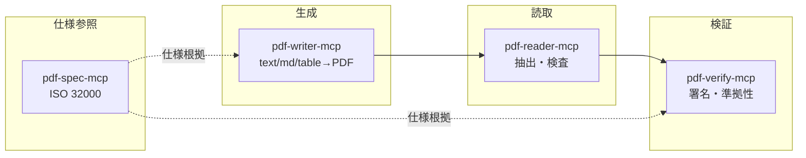

# pdf-writer-mcp

テキスト / Markdown / 表データからの **PDF 生成** と、既存 PDF の **編集**（メタデータ・ページ操作）を行う
MCP (Model Context Protocol) サーバです。
[pdf-lib](https://pdf-lib.js.org/) をコアに、日本語フォントの埋め込み（サブセット）に対応します。

## 位置づけ

`shuji-bonji` の PDF 系 MCP エコシステムにおける「生成（write）」担当です。
読み取り・検証系とは責務を分けています。



## 特徴

- **3 つの生成ツール**: プレーンテキスト / Markdown / 表
- **7 つの編集ツール**: メタデータ更新、結合・分割・抽出・削除・並べ替え・回転
- **署名ガード**: 電子署名済み PDF（`/ByteRange` 検知）の編集は既定でエラーにし、
  署名の意図しない無効化を防止（`allowBreakingSignatures: true` で明示的に続行可能）
- **日本語対応**: `.ttf` / `.otf` フォントを harfbuzz でサブセット埋め込み（4.5MB のフォントでも出力は数十 KB）
- **抽出・検索・コピー可能**: 埋め込みフォントでも ToUnicode CMap が付与されるため、
  生成した PDF のテキストは選択・コピー・全文検索・スクリーンリーダ読み上げが可能
- **自動レイアウト**: テキスト折り返し（日英混在・長語の強制分割）、改ページ、表の改ページ時ヘッダ再描画
- **出力先の柔軟性**: ファイル保存 / base64 返却の両対応
- **堅牢な入力検査**: `asserts` によるバリデーションで不正値を早期に弾く

## MCP クライアント設定

`claude_desktop_config.json`（例、npm 公開版を npx で起動）:

```json
{
  "mcpServers": {
    "pdf-writer": {
      "command": "npx",
      "args": ["-y", "@shuji-bonji/pdf-writer-mcp"],
      "env": {
        "PDF_WRITER_FONT": "/absolute/path/to/NotoSansJP-Regular.otf"
      }
    }
  }
}
```

ローカルのソースから起動する場合:

```json
{
  "mcpServers": {
    "pdf-writer": {
      "command": "node",
      "args": ["/absolute/path/to/pdf-writer-mcp/dist/index.js"],
      "env": {
        "PDF_WRITER_FONT": "/absolute/path/to/NotoSansJP-Regular.otf"
      }
    }
  }
}
```

`PDF_WRITER_FONT` を設定しておくと、各ツールで `fontPath` を省略しても日本語が出せます。

## 開発

```bash
npm install
npm run build      # dist/ に出力
npm test           # vitest
npm run typecheck  # tsc --noEmit
```

## フォントについて（重要）

- 標準フォント（Helvetica）は **ASCII のみ**。日本語を含む場合は `fontPath` か `PDF_WRITER_FONT` で
  埋め込み可能な **単一フォント（`.ttf` / `.otf`）** を指定してください。
- **`.ttc`（TrueTypeCollection）は非対応**です（pdf-lib がサブセット化できないため、検知してエラーにします）。
  `.ttc` しか手元にない場合は、単一フェイスを抽出してください。

  ```bash
  # 例: Noto Sans CJK の .ttc から日本語フェイス(index 0)を .otf として取り出す
  python3 -c "from fontTools.ttLib import TTCollection; \
    TTCollection('NotoSansCJK-Regular.ttc').fonts[0].save('NotoSansCJKjp-Regular.otf')"
  ```

- 日本語フォントの入手先の例:
  [notofonts/noto-cjk の日本語サブセット OTF](https://github.com/notofonts/noto-cjk/tree/main/Sans/SubsetOTF/JP)（SIL OFL、静的・単一フェイス）。

### フォント未収録文字（グリフ欠落）の扱い

指定フォントに存在しない文字（例: Noto Sans JP に無い ✔ U+2714 や絵文字）を検知した場合の
挙動を `onMissingGlyph` で選べます（v0.2.1〜）:

| 値 | 挙動 |
|----|------|
| `error`（既定） | 欠落文字を `"✔" (U+2714)` 形式で列挙してエラー。無警告の空白出力を防ぐ |
| `replace` | 〓（下駄記号）に置換して生成し、`warnings` で報告 |
| `ignore` | そのまま生成（該当文字は空白になる）し、`warnings` で報告 |

## ツール

### `create_text_pdf`

プレーンテキスト → PDF。`\n` で改行、空行で段落区切り。長い行は自動折り返し。

| 引数 | 型 | 必須 | 説明 |
|------|----|:---:|------|
| `text` | string | ✓ | 本文 |
| `outputPath` | string |  | 保存先。省略時は base64 を返す |
| `returnBase64` | boolean |  | 保存に加えて base64 も返す |
| `fontPath` | string |  | 埋め込むフォント（日本語は必須） |
| `fontSize` | number |  | 本文サイズ pt（既定 11、4〜96） |
| `pageSize` | enum |  | A4/A3/A5/LETTER/LEGAL（既定 A4） |
| `margin` | number |  | 余白 pt（既定 56、0〜300） |
| `title` | string |  | タイトル（メタデータ＋冒頭見出し） |
| `author` | string |  | 作成者（メタデータ） |
| `onMissingGlyph` | enum |  | フォント未収録文字の扱い: error（既定）/ replace / ignore |

### `create_markdown_pdf`

Markdown → PDF。対応要素: 見出し / 段落 / 箇条書き・番号リスト / コードブロック / 引用 / 水平線 / 表。
インライン装飾（`**bold**` など）は単一フォントのため **記号を除去して字面のみ** 反映します。

引数は `text` の代わりに `markdown`（string, 必須）。その他は共通。

### `create_table_pdf`

ヘッダ + 行データ → 罫線付きの表 PDF。列幅は内容から自動算出、セル内は折り返し、改ページ時はヘッダを再描画。

| 引数 | 型 | 必須 | 説明 |
|------|----|:---:|------|
| `headers` | string[] | ✓ | 列見出し |
| `rows` | string[][] | ✓ | データ行（各行は headers と同数の列を推奨） |

その他は共通引数。

## 編集ツール（v0.2.0〜）

既存 PDF に対する操作です。共通引数: `outputPath`（省略時は base64 返却）/ `returnBase64` /
`allowBreakingSignatures`（署名済み PDF の編集続行フラグ、既定 false）。

ページ指定は `"1,3-5,8-"` 形式（1 始まり。`-3` = 先頭から 3 まで、`8-` = 8 から最終まで）。

| ツール | 主な引数 | 説明 |
|--------|----------|------|
| `set_metadata` | `inputPath`, `title` / `author` / `subject` / `keywords` / `creator` | 指定フィールドのみ更新、他は保持 |
| `merge_pdfs` | `inputPaths: string[]` | 指定順に結合（2〜50 ファイル） |
| `split_pdf` | `inputPath`, `ranges: string[]`, `outputDir`, `prefix?` | 範囲ごとに連番ファイルへ分割 |
| `extract_pages` | `inputPath`, `pages` | 指定順を保持して抽出（並べ替えを兼ねる） |
| `delete_pages` | `inputPath`, `pages` | ページ削除（全削除はエラー） |
| `reorder_pages` | `inputPath`, `order: number[]` | 全ページの順列で並べ替え |
| `rotate_pages` | `inputPath`, `rotation: 90\|180\|270`, `pages?` | 時計回りに回転（既存回転に加算） |

> **署名について**: pdf-lib はファイル全体を再構築して保存するため、編集すると既存の電子署名は
> 必ず無効化されます。署名（`/ByteRange`）を検知した場合は既定でエラーとし、
> `allowBreakingSignatures: true` を指定したときのみ続行します。
> 署名を保持する増分更新は将来対応（ロードマップ参照）。

### 返り値（共通）

```jsonc
{
  "path": "/abs/out.pdf",   // outputPath 指定時
  "base64": "JVBERi0xLj...", // returnBase64 or outputPath 未指定時
  "pageCount": 3,
  "bytes": 91788,
  "font": "NotoSansJP-Regular.otf"
}
```

## テキスト抽出・検索について

生成される PDF は **テキストの選択・コピー・全文検索が可能** です。
埋め込みフォント使用時も pdf-lib が ToUnicode CMap（CID→Unicode の逆引き）を出力するため、
`pdftotext` 等で本文を抽出できます。この性質は `tests/extract.test.ts` の回帰テストで担保しています
（ToUnicode に `日 → U+65E5` のマッピングが含まれることを検証）。

> **v0.3.0 の重要な修正**: v0.2.1 以前は pdf-lib（fontkit）のサブセッタを使っており、
> 日本語フォントのグリフが破壊されて**すべてのビューアで文字が豆腐・空白になる**不具合がありました
> （テキスト抽出だけは正常なため気づきにくい状態でした）。v0.3.0 で harfbuzz による事前サブセットに
> 切り替え、サイズはより小さく（実測 24KB → 14.5KB）、描画は正常になっています。

## 既知の制約

- **インライン装飾**: 太字・斜体などはサイズ/字面のみで、書体としては反映されません
  （見出し/本文/太字を別フェイスで埋め分ける対応はロードマップ参照）。
- **`.ttc` 非対応**: 単一フェイスへの抽出が必要です（上記参照）。
- **サブセット名の接頭辞**: pdf-lib は慣習的な `ABCDEF+` 接頭辞を付けないため、
  一部ツールがサブセットでないと誤認します（表示・抽出には無影響。PDF/A 厳密対応時の項目）。

## ロードマップ

- [x] 編集系 Tier A 第1波（メタデータ・ページ操作）— v0.2.0
- [ ] 編集系 Tier A 第2波（しおり・注釈）
- [ ] 編集系 Tier B（フォーム記入・フラット化 / 透かし / 添付ファイル / ページ番号スタンプ）
- [ ] タグ付き PDF / PDF/UA 対応（スクリーンリーダ向けの構造タグ。抽出可否とは別レイヤの本格対応）
- [ ] `.ttc` からのフェイス自動抽出（Node だけで完結）
- [ ] 見出し用と本文用のフォント分け（太字フェイス埋め込み）
- [ ] 画像埋め込み / ヘッダー・フッター
- [ ] 署名を保持する増分更新・本文テキスト編集・タグ木保守（Tier C）
- [ ] PDF/A 変換（サブセット命名の正規化を含む・外部ツール連携）

## ライセンス

MIT © shuji-bonji
