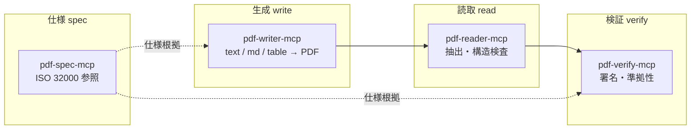
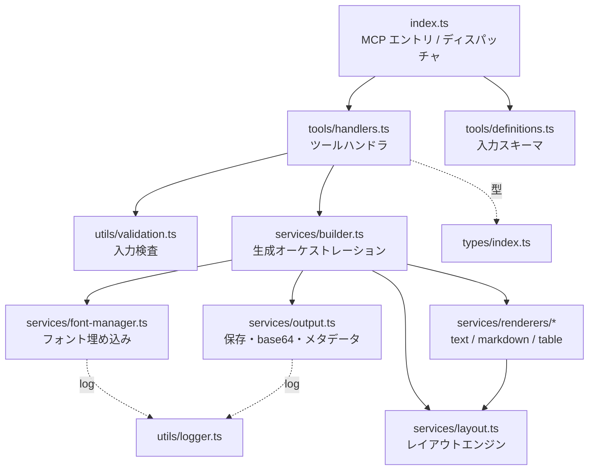
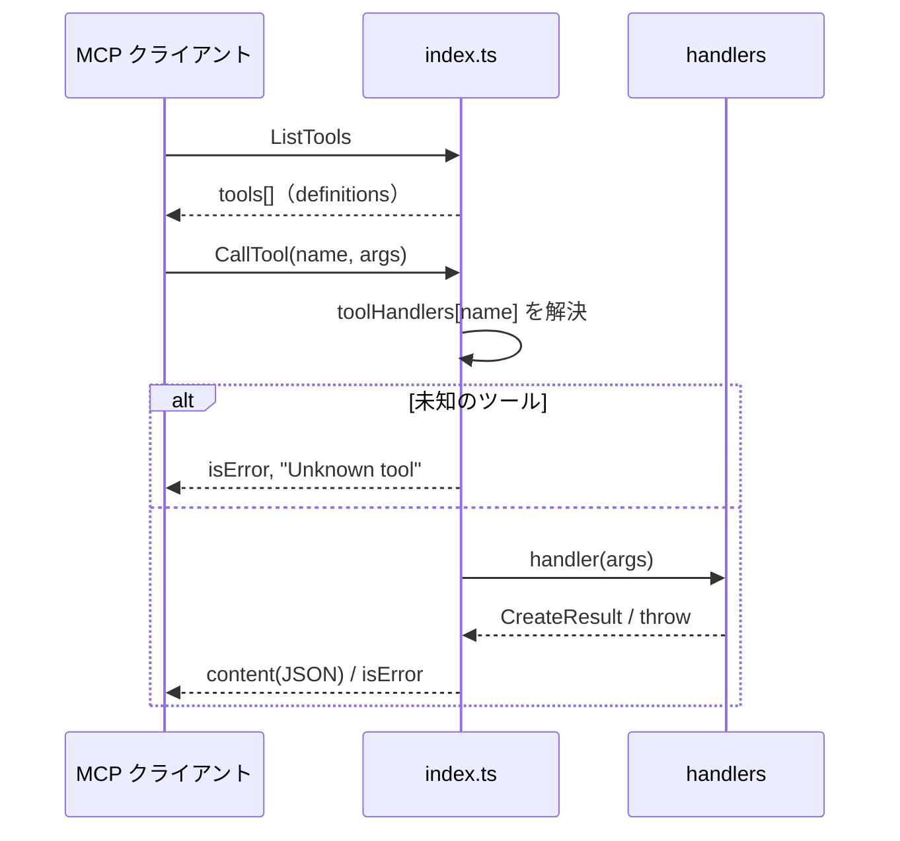
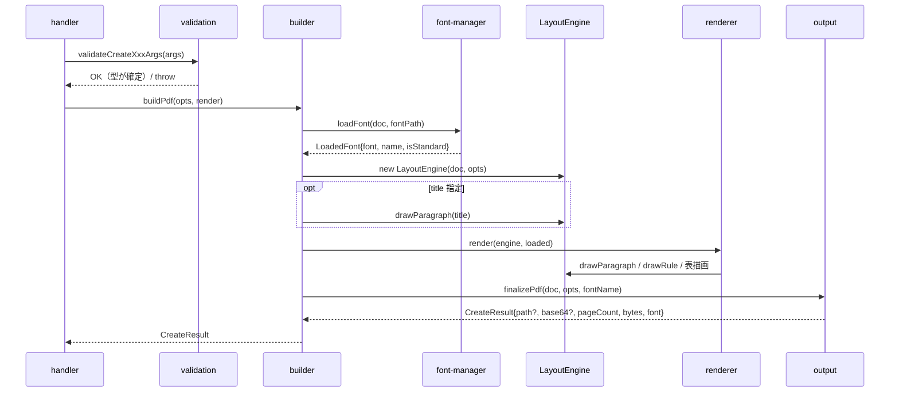
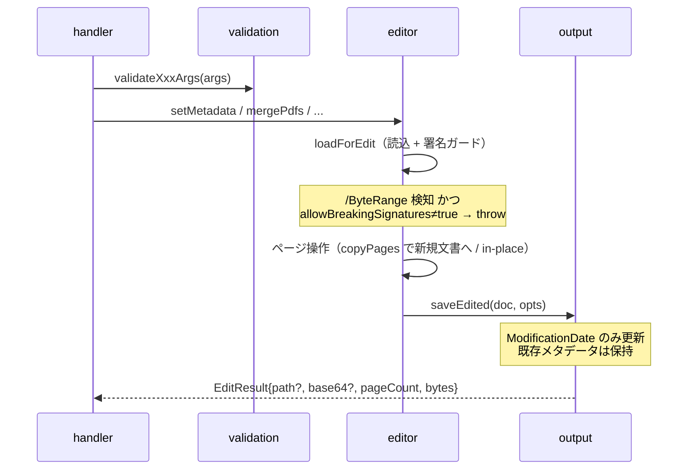
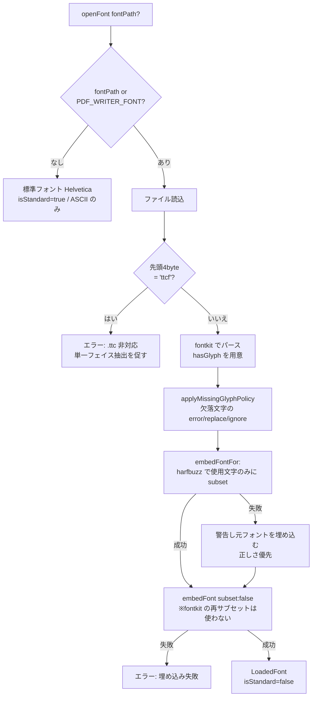
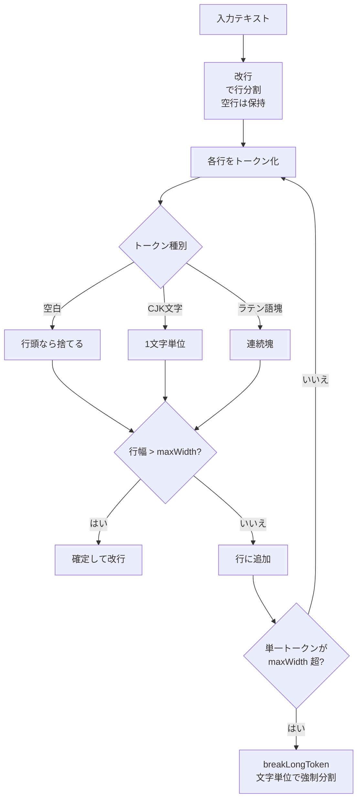
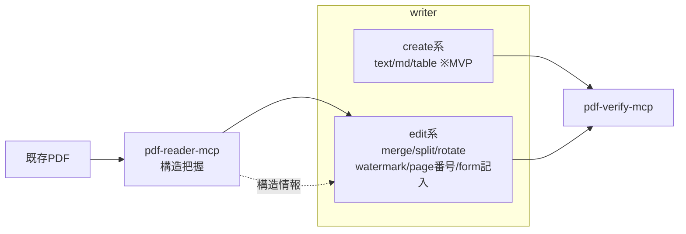

# pdf-writer-mcp 設計書

| 項目 | 内容 |
|------|------|
| ドキュメント種別 | 設計書（Design Document） |
| 対象システム | `@shuji-bonji/pdf-writer-mcp` |
| バージョン | 0.3.1（MVP + Tier A 編集系 第1波 + サブセット方式の刷新） |
| リポジトリ | https://github.com/shuji-bonji/pdf-writer-mcp |
| 最終更新 | 2026-07-16 |
| ステータス | create 系 3 ツール + 編集系 7 ツール実装済み |

---

## 1. 概要

### 1.1 目的

テキスト・Markdown・表データを入力として **PDF を新規生成** する MCP (Model Context Protocol) サーバを提供する。
LLM エージェント（Claude Desktop 等）から自然言語の指示で、体裁の整った日本語 PDF を生成できることを目標とする。

### 1.2 スコープ

**対象（MVP = create 系）**

- プレーンテキスト → PDF
- Markdown → PDF（見出し・段落・リスト・コード・引用・水平線・表）
- 表データ（ヘッダ＋行）→ PDF
- 日本語フォントのサブセット埋め込み
- ファイル保存 / base64 返却

**対象（v0.2.0 = 編集系 Tier A 第1波、PDFfamily specs/05 準拠）**

- メタデータ更新（set_metadata）
- ページ操作（merge / split / extract / delete / reorder / rotate）
- 署名ガード（/ByteRange 検知時は既定でエラー、明示フラグで続行）

**対象外（将来）**

- しおり・注釈（Tier A 第2波）、透かし・フォーム記入・添付ファイル（Tier B）
- タグ付き PDF / PDF/UA（アクセシビリティの構造タグ）
- PDF/A 変換、電子署名の付与、署名を保持する増分更新（Tier C）
- 画像埋め込み・ヘッダー/フッター・ページ番号

### 1.3 用語

| 用語 | 説明 |
|------|------|
| MCP | Model Context Protocol。LLM とツールを繋ぐプロトコル |
| サブセット埋め込み | フォントから使用グリフのみを抽出して PDF に埋め込む手法 |
| ToUnicode CMap | CID/グリフ番号から Unicode への逆引き表。テキスト抽出・検索に必須 |
| CID フォント | 大規模文字集合（CJK 等）向けのフォント形式 |
| WinAnsi | 標準14フォントが使う Latin-1 系エンコーディング |

---

## 2. 背景とエコシステム上の位置づけ

本サーバは `shuji-bonji` の PDF 系 MCP 群における「生成（write）」担当である。
読み取り・検証は既存サーバが担い、責務を分離する。



将来 writer は「新規生成（create）」に加え「既存 PDF 編集（edit）」の二面性を持ち、
reader の後段（read → edit → verify）に位置づく想定である（§12 参照）。

---

## 3. 要件

### 3.1 機能要件（FR）

| ID | 要件 |
|----|------|
| FR-1 | テキストから PDF を生成できる（改行・空行段落・自動折り返し・改ページ） |
| FR-2 | Markdown から PDF を生成できる（見出し/リスト/コード/引用/水平線/表） |
| FR-3 | 表データから罫線付き PDF を生成できる（列幅自動・セル折り返し・改ページ時ヘッダ再描画） |
| FR-4 | 日本語を含むテキストを、埋め込みフォントで描画できる |
| FR-5 | 出力をファイル保存、または base64 で返却できる |
| FR-6 | ページサイズ・マージン・フォントサイズ・タイトル・作成者を指定できる |
| FR-7 | 生成 PDF のテキストは抽出・検索・コピーが可能である |

### 3.2 非機能要件（NFR）

| ID | 要件 | 方針 |
|----|------|------|
| NFR-1 | MCP stdio プロトコルを汚染しない | `console.log` 禁止、全ログを stderr へ |
| NFR-2 | 不正入力を早期・明確に拒否する | `asserts` バリデーション＋上限値 |
| NFR-3 | 巨大入力による暴走を防ぐ | テキスト長・表サイズの上限 |
| NFR-4 | フォント埋め込みサイズを抑える | サブセット化（16MB→数十KB） |
| NFR-5 | 保守性・拡張性 | レイヤ分離、ツール追加は Map に1行 |
| NFR-6 | 回帰を防ぐ | vitest による層別テスト |

---

## 4. アーキテクチャ

### 4.1 レイヤ構成



**設計原則**

- `index.ts` は薄いディスパッチャに徹し、`try/catch` を一元化（`isError:true` を返す）。
- ハンドラは例外を **throw** する（`{error}` を返さない）。整形は `index.ts` が担う。
- ビジネスロジック（生成）は `services/` に集約し、レンダラは責務ごとに分割。

### 4.2 ディレクトリ構成

```
pdf-writer-mcp/
├── src/
│   ├── index.ts                     # MCP サーバ起動・ディスパッチ
│   ├── config.ts                    # 版数（動的取得）・環境変数キー・既定値
│   ├── constants.ts                 # ページサイズ・上限値・マジックナンバー
│   ├── types/index.ts               # 共有型
│   ├── tools/
│   │   ├── definitions.ts           # ツール入力スキーマ
│   │   └── handlers.ts              # ハンドラ＋ディスパッチ Map
│   ├── services/
│   │   ├── builder.ts               # 生成フロー共通化
│   │   ├── struct-tree.ts           # タグ付き PDF: 構造木を「ゼロから構築」（create 系）
│   │   ├── struct-append.ts         # タグ付き PDF: 既存構造木へ「追記」（編集系）
│   │   ├── xmp.ts                   # XMP 生成（pdfuaid 宣言・拡張スキーマ・dc:title）
│   │   ├── editor.ts                # 編集系（Tier A: メタデータ・ページ操作・署名ガード）
│   │   ├── font-manager.ts          # 埋め込み・.ttc 検知・フォールバック
│   │   ├── layout.ts                # 折返し・改ページ・描画
│   │   ├── output.ts                # 保存・base64・メタデータ（finalizePdf / saveEdited）
│   │   └── renderers/
│   │       ├── text.ts              # テキスト
│   │       ├── markdown.ts          # Markdown
│   │       └── table.ts             # 表
│   └── utils/
│       ├── logger.ts                # stderr ログ抽象化
│       ├── page-spec.ts             # "1,3-5,8-" ページ指定パーサ
│       └── validation.ts            # asserts 検査
├── tests/                           # validation / layout / generate / extract / editor / page-spec
├── docs/DESIGN.md                   # 本書
├── package.json / tsconfig.json / vitest.config.ts / .gitignore
└── README.md / LICENSE
```

### 4.3 責務分担

| モジュール | 責務 | 依存 |
|-----------|------|------|
| `index.ts` | MCP 起動、ツール一覧応答、呼出しの try/catch 集約 | tools, logger |
| `tools/definitions.ts` | JSON スキーマ定義 | （なし） |
| `tools/handlers.ts` | 検査 → builder 呼出し | validation, builder, renderers |
| `services/builder.ts` | doc生成→フォント→エンジン→描画→保存の統括 | font-manager, layout, output |
| `services/font-manager.ts` | フォント読込・埋め込み・種別判定 | pdf-lib, fontkit |
| `services/layout.ts` | 座標管理・折返し・改ページ・描画 API | pdf-lib |
| `services/renderers/*` | 各入力を layout API で描画 | layout |
| `services/output.ts` | メタデータ・保存・base64 | pdf-lib |
| `utils/validation.ts` | asserts による入力検査 | constants |
| `utils/logger.ts` | stderr ログ | （なし） |

---

## 5. 処理フロー

### 5.1 起動とツール呼出しのディスパッチ



### 5.2 PDF 生成フロー



---

## 6. ツール仕様

共通オプション: `outputPath` / `returnBase64` / `fontPath` / `fontSize` / `pageSize`(A4/A3/A5/LETTER/LEGAL) / `margin` / `title` / `author` / `onMissingGlyph`(error|replace|ignore)。

| ツール | 固有入力 | 説明 |
|--------|----------|------|
| `create_text_pdf` | `text: string` | 改行・空行段落・自動折り返し |
| `create_markdown_pdf` | `markdown: string` | 見出し/リスト/コード/引用/水平線/表 |
| `create_table_pdf` | `headers: string[]`, `rows: string[][]` | 罫線付き表・改ページ時ヘッダ再描画 |

**返り値（共通）**

```jsonc
{
  "path": "/abs/out.pdf",     // outputPath 指定時
  "base64": "JVBERi0xLj...",  // returnBase64 or outputPath 未指定時
  "pageCount": 3,
  "bytes": 91788,
  "font": "NotoSansJP-Regular.otf"
}
```

### 6.1 編集系ツール（Tier A 第1波）

共通オプション: `outputPath` / `returnBase64` / `allowBreakingSignatures`。

| ツール | 固有入力 | 説明 |
|--------|----------|------|
| `set_metadata` | `inputPath`, `title?`, `author?`, `subject?`, `keywords?`, `creator?` | 指定フィールドのみ更新、他は保持 |
| `merge_pdfs` | `inputPaths: string[]`（2〜50） | 指定順に結合。メタデータは先頭から引き継ぎ |
| `split_pdf` | `inputPath`, `ranges: string[]`, `outputDir`, `prefix?` | 範囲ごとに連番ファイルへ分割 |
| `extract_pages` | `inputPath`, `pages: string` | 指定順を保持して抽出（並べ替え兼用） |
| `delete_pages` | `inputPath`, `pages: string` | 削除（全ページ削除はエラー） |
| `reorder_pages` | `inputPath`, `order: number[]` | 全ページの順列で並べ替え |
| `rotate_pages` | `inputPath`, `rotation: 90\|180\|270`, `pages?` | 時計回り回転。既存回転に加算 |

ページ指定は `"1,3-5,8-"` 形式（1 始まり、`-3`/`8-` の開端も可、重複除去・指定順保持）。
パーサは `utils/page-spec.ts` に集約。

**編集フロー**（create 系の builder を通らない並列系統）



**署名保全（specs/05 §3-1 対応）**: pdf-lib の save() は全体再構築のため既存署名を必ず無効化する。
入力バイト列の `/ByteRange` を検知したら既定でエラーにし、`allowBreakingSignatures: true` でのみ続行。
署名を保持する増分更新は Tier C（`incremental_save`）で対応する。

**入力上限（constants.ts）**

| 項目 | 値 | 根拠 |
|------|----|------|
| fontSize | 4〜96 pt | 実用範囲・暴走防止 |
| margin | 0〜300 pt | 0=全面、上限で破綻防止 |
| text 最大長 | 500,000 文字 | DoS・巨大PDF防止 |
| 表 最大列/行 | 40 / 5,000 | レイアウト破綻・肥大防止 |

---

## 7. 主要コンポーネント設計

### 7.1 font-manager（フォント戦略）

最重要の設計判断。日本語生成の可否とサイズを左右する。



**確定した方針**（v0.3.0 改訂）

- 単一 `.ttf/.otf` を **harfbuzz（subset-font）で事前サブセット**し、pdf-lib には `subset:false` で
  埋め込む。**pdf-lib（fontkit）のサブセッタは使わない** — CJK グリフを破壊するため（ADR-7・付録 A.1）。
- `.ttc`（TrueTypeCollection）は pdf-lib がサブセット化できず失敗するため、
  マジックバイト `ttcf` で **検知して明示的にエラー**にする（単一フェイス抽出を案内）。
- フォント未指定時は標準 `Helvetica`（`isStandard=true`）。
- 標準フォント × 非 Latin-1 文字（日本語等）は、描画前に **renderer 側で親切なエラー** に変換（§8）。

**グリフ欠落ポリシー（v0.2.1）**

フォント未収録文字（例: Noto Sans JP に無い ✔ U+2714）は pdf-lib が無警告で .notdef（空白）を
埋め込んでしまう。これを防ぐため、埋め込み時に fontkit で二重パースして
`hasGlyphForCodePoint` による照会関数を `LoadedFont.hasGlyph` として保持し、
builder が描画前に全入力テキストを走査する（`applyMissingGlyphPolicy`）。
`onMissingGlyph` は error（既定・欠落文字を列挙して throw）/ replace（〓 置換 + warnings）/
ignore（従来動作 + warnings）。warnings は `CreateResult.warnings` で返却する。
標準フォントは従来どおり `assertRenderable`（Latin-1 検査）が担当。

**GSUB 置換と ToUnicode の不整合（v0.3.1・ADR-8）**

pdf-lib の `CustomFontEmbedder`（subset:false）は 2 つの経路で別々にグリフを求める。

| 用途 | 経路 | 結果 |
|------|------|------|
| 本文に書く CID | `font.layout(text)` | GSUB 適用**後**のグリフ |
| ToUnicode CMap | `font.characterSet` → `glyphForCodePoint` | GSUB 適用**前**のベースグリフ |

Noto Sans JP はラテン文脈の数字を別字形に置換するため（`layout('English 0')` の 0 は
gid 17 ではなく **17460**）、CID と ToUnicode がずれて抽出が壊れる
（`v0.3.0` → `vô.õ.ô`、poppler では欠落。描画は正しいので気づきにくい）。

対策は harfbuzz サブセット時の `noLayoutClosure: true`。置換候補グリフをサブセットに
含めないため置換自体が発生せず、`layout()` == `glyphsForString()` となって両者が一致する。
`render.test.ts` がこの一致を検証する。

> なお `subset:true`（旧実装）は ToUnicode を「実際に描画したグリフ」から作るためこの問題は
> 起きなかった。つまり **v0.3.0 でのみ発生した回帰**であり、旧実装は別の理由（ADR-7）で破綻していた。

**ToUnicode について**（重要な発見）

pdf-lib の `embedFont(subset)` は **ToUnicode CMap を自動付与する**。
そのため生成 PDF は埋め込みフォントでも抽出・検索・コピーが可能。
当初「抽出不可」と誤認していたが、実測（pikepdf）で ToUnicode に `日→U+65E5` 等の正しい逆引きを確認済み。
→ 自前の ToUnicode 付与は **不要**。回帰テスト（§9）で担保する。

### 7.2 LayoutEngine（レイアウトエンジン）

pdf-lib の低レベル API（座標指定 `drawText`）の上に、上端(top)基準のカーソル管理を載せる薄い層。

**座標系**

- pdf-lib は左下原点。本エンジンは「上端 `cursorTop`」を管理し、下方向へ積む。
- ベースライン = `cursorTop - fontSize * ASCENT_RATIO`（`ASCENT_RATIO = 0.8` の近似）。
- 見出し・本文・表でサイズが変わっても top 基準で一貫して積み上がる。

**折り返しアルゴリズム `wrapText`**



- 日英混在に対応（CJK は任意位置改行可、ラテンは単語単位）。
- URL 等の長大トークンは文字単位で強制分割。
- 幅測定は `font.widthOfTextAtSize` を使用（標準/埋め込み両対応）。

**主な公開 API**: `drawParagraph` / `drawRule` / `newPage` / `ensureSpace` / `moveDown` /
アクセサ（`page`, `leftX`, `bottomY`, `contentWidth`, `cursorTop`, `defaultFont`, `defaultSize`）。

### 7.3 renderers

| renderer | 方針 |
|----------|------|
| text | 空行で段落分割し `drawParagraph`。冒頭で標準フォント×非Latin1を検査 |
| markdown | `marked.lexer` でブロックトークン化。heading/paragraph/list/code/blockquote/table/hr/space を描画。インライン記号は除去し字面のみ反映 |
| table | 列幅を内容から自動算出（上限クランプ→比例配分）。セル折返し、ヘッダ背景、罫線、改ページ時ヘッダ再描画 |

markdown の表描画は table renderer を共有（重複実装を排除）。

### 7.4 output

`setTitle/Author/Producer/CreationDate/ModificationDate` を付与 → `doc.save()`。
`outputPath` があれば `mkdir -p` して保存、なければ（または `returnBase64`）base64 を返す。

### 7.5 validation

`asserts` 型述語で narrowing しつつ検査。閾値は `constants.ts` に集約。
`validateCreateTextArgs` / `validateCreateMarkdownArgs` / `validateCreateTableArgs` /
`validateCommonOptions` / `validatePageSize` を提供。

### 7.6 logger

`debug/info/warn/error` すべて `console.error`（stderr）へ。第1引数に `context` を必須化。
MCP の stdio（JSON-RPC）を汚染しないための最重要規約。

---

## 8. エラーハンドリング方針

- ハンドラ／サービスは**例外を throw** する。`index.ts` が一元 catch し、
  `{ content:[{type:text, text:JSON({error})}], isError:true }` に整形。
- ユーザ起因の誤りは**行動可能なメッセージ**にする。代表例：
  - 日本語 × フォント未指定 → 「`fontPath` に .ttf/.otf を指定、または `PDF_WRITER_FONT` を設定」
  - `.ttc` 指定 → 「単一フェイスを抽出してください（fonttools 例つき）」
  - フォント未検出／埋め込み失敗 → 具体的なパスと原因を提示
- 標準フォント×非Latin1は、pdf-lib の低レベル例外に頼らず、renderer 冒頭の
  `assertRenderable` で**事前に**検査して明快に弾く。

---

## 9. テスト戦略

| テスト | 対象 | フォント依存 |
|--------|------|:---:|
| `validation.test.ts` | 入力検査の正常/異常系 | 不要 |
| `layout.test.ts` | `wrapText`（折返し/CJK/長語分割）・`hasNonLatin1` | 不要（標準フォント） |
| `generate.test.ts` | 3ツールの生成・ページ数・ガード（日本語×無フォント等） | 一部（skipIf） |
| `extract.test.ts` | 抽出可能性の回帰（標準=hex復号一致、埋込=ToUnicodeに日→65E5） | 一部（skipIf） |
| `glyph.test.ts` | onMissingGlyph の error/replace/ignore | 一部（skipIf） |
| `render.test.ts` | **描画実体の回帰**（埋め込みフォントを取り出し、使用文字のアウトラインが残存するか） | 一部（skipIf） |

> `render.test.ts` の存在理由: v0.2.1 以前のグリフ破損（ADR-7）は ToUnicode が正しかったため
> `extract.test.ts` を素通りした。**抽出できること ≠ 描画できること**。旧実装に戻すと本テストが
> 失敗することを確認済み（バグ捕捉能力の検証）。

- 日本語フォント依存テストは `TEST_FONT_PATH` があるときのみ実行（`describe.skipIf`）。
  CI にフォントが無くても標準フォント分は常に検証される。
- 抽出テストは **外部ツール非依存**（Node の `zlib` でストリーム展開して検証）。

```bash
npm test                                    # 標準フォント分
TEST_FONT_PATH=/path/NotoSansJP.otf npm test  # 日本語 ToUnicode も検証
```

---

## 10. 既知の制約

| 制約 | 内容 | 影響 |
|------|------|------|
| インライン装飾 | 太字/斜体は字面のみ（書体反映なし） | 単一フォント運用のため |
| `.ttc` 非対応 | 単一フェイス抽出が必要 | Node 単体で分解困難 |
| サブセット名接頭辞 | `ABCDEF+` を付けない | 一部ツールが誤認。表示/抽出は無影響、PDF/A 厳密対応時の課題 |
| ~~poppler 警告は無害~~ | ~~`Embedded font file may be invalid`~~ | **誤り（v0.3.0 で訂正）**。この警告は実害ありで、poppler は続けて `Couldn't create a font` を出し全文字が豆腐化していた。原因は fontkit サブセッタのグリフ破損（ADR-7）。harfbuzz 事前サブセットで解消 |
| フォント種別の警告 | `Mismatch between font type and embedded font file` | 無害。OTF(CFF) を CIDFontType0 として埋め込む際の poppler の指摘で、描画・抽出とも正常 |

---

## 11. 設計判断記録（ADR ダイジェスト）

| # | 判断 | 理由 | 却下案 |
|---|------|------|--------|
| ADR-1 | コアに **pdf-lib** を採用 | 依存が軽く Node/ESM 純正、既存 pdf 系と親和 | pdfkit（生成専用だが将来の編集で不利）、puppeteer（Chromium 依存で重い） |
| ADR-2 | ~~フォントは 単一 .ttf/.otf + pdf-lib subset~~ → **harfbuzz で事前サブセット + subset:false 埋め込み**（v0.3.0 改訂） | pdf-lib(fontkit) のサブセッタは CJK グリフを破壊し全ビューアで豆腐化する（下記 ADR-7）。harfbuzz なら小さく・正しい | フルフォント埋め込み（3.9MB 肥大）、fontkit subset（破損） |
| ADR-3 | **.ttc は非対応**（検知して弾く） | pdf-lib が subset 不可、Node 単体分解が困難 | 実行時分解（Python 依存を持ち込むことになる） |
| ADR-4 | ToUnicode の自前付与は**しない** | pdf-lib が既に正しく出力（実測確認） | 独自 CMap 注入（不要かつ二重化リスク） |
| ADR-5 | レイアウトは **自前の薄い層** | Markdown/表の自動組版に必要 | 外部組版ライブラリ（重い・過剰） |
| ADR-6 | 生成フローを **builder に共通化** | 3ツールで doc→font→engine→render→save が同一 | 各ハンドラで重複実装 |
| ADR-7 | **fontkit のサブセッタを使わない**（v0.3.0） | Noto Sans JP で glyph が失われ、poppler/Chrome/Firefox/Acrobat すべてで豆腐・空白になることを実測。ToUnicode は正しいため抽出テストでは検知できず、`render.test.ts` で担保する | pdf-lib `embedFont(subset:true)`（破損）、`subset:false` 単体（3.9MB） |
| ADR-9 | 構造木を **「構築（struct-tree）」と「追記（struct-append）」に分離**（v0.5.1） | create 系はゼロから作れるが、編集系は既存の StructTreeRoot / ParentTree を読んで**続きの番号**で追記する必要がある。両者は入力も不変条件も違うため、無理に共通化しない。追記側は Tier C の `ensure_tagged` の足がかりになる | 単一クラスに両モードを持たせる（分岐が増え、ParentTree の不変条件が曖昧になる） |
| ADR-8 | harfbuzz サブセット時に **`noLayoutClosure: true`** を指定（v0.3.1） | pdf-lib(subset:false) は CID を `font.layout()` の結果から、ToUnicode を cmap 由来のベースグリフから作る。GSUB 置換が起きると両者がずれ、抽出が壊れる（§7.1 参照）。置換候補をサブセットに含めなければ置換自体が起きない。副次効果でサイズも縮小（9.1KB→4.5KB） | ToUnicode の後段パッチ（pdf-lib 内部への侵襲）、GSUB テーブルの手動除去（sfnt 再構築が必要） |

---

## 12. 拡張設計・ロードマップ

将来 writer は「生成」に「編集」を加えた二面性を持つ。



**優先順位**（2026-07-16 改訂: PDFfamily specs/05 の Tier 体系と `mcps/pdf-family-role-architecture.md` に整合）

1. ~~編集系 Tier A 第1波（メタデータ・ページ操作）~~ **v0.2.0 で実装済み**
2. 編集系 Tier A 第2波: `add_bookmarks` / `add_annotation`（pdf-lib 低レベル辞書操作）
3. 編集系 Tier B: `fill_form` / `flatten_form` / `add_watermark` / `attach_file`（PDF/A-3・電帳法）/ `stamp_page_numbers`
4. **タグ付き PDF / PDF/UA 生成**（前提: pdf-verify-mcp への PDF/UA flavour 追加 = 役割分担提案 M-1。verify を採点者にしてから着手）
5. `.ttc` フェイス自動抽出、見出し/本文のフォント分け、画像・ヘッダー/フッター・ページ番号
6. Tier C（`edit_text` / `ensure_tagged` / `incremental_save`）= pdf-engine-core と合流
7. PDF/A 変換（サブセット命名の正規化を含む・外部ツール連携）

**命名指針**

- create 系: `create_text_pdf` / `create_markdown_pdf` / `create_table_pdf`（現行）
- edit 系: `set_metadata` / `merge_pdfs` / `split_pdf` / `extract_pages` / `delete_pages` / `reorder_pages` / `rotate_pages`（実装済み）、
  `add_bookmarks` / `add_annotation` / `fill_form` / `flatten_form` / `add_watermark` / `attach_file` / `stamp_page_numbers`（将来）

edit 系は「reader が返す構造情報（ページ数・フォームフィールド一覧等）を入力に取る」設計とし、
reader との連携を自然にする。

---

## 付録 A: フォント埋め込み実測データ

| ケース | 結果 |
|--------|------|
| `.ttc` を直接 embed（subset:true） | 失敗（`createSubset is not a function`） |
| `.ttc` を直接 embed（subset:false） | 失敗（`layout is not a function`） |
| ToUnicode（pikepdf 検査） | 存在。`<0001> <65E5>`（日）等の正しい逆引き |
| `pdffonts` | `uni yes`（ToUnicode 認識）、`emb yes` |
| `qpdf --check` | 構造エラーなし |

### A.1 サブセット方式の比較（v0.3.0・NotoSansJP-Regular.otf 4.5MB / 本文 35 文字）

| 方式 | PDF サイズ | 描画 | 備考 |
|------|-----------|------|------|
| pdf-lib `subset:true`（fontkit） | 24KB | ✗ **全滅**（豆腐） | poppler: `Embedded font file may be invalid` → `Couldn't create a font`。Chrome/Firefox/Acrobat/Claude Desktop でも同様。ToUnicode は正しいため**抽出だけは通る**（検知困難） |
| pdf-lib `subset:false` | 3.9MB | ✓ 正常 | 正しいが実用外のサイズ |
| **harfbuzz(subset-font) + `subset:false`** | **14.5KB** | **✓ 正常** | **採用**。fontkit サブセットより小さく、かつ正しい |

> 注: TTF（可変フォント）でも fontkit サブセットは同様に破損した（一部文字のみ描画）。
> 問題は入力フォントの形式ではなく fontkit のサブセッタにある。

## 付録 B: 参考

- pdf-lib: https://pdf-lib.js.org/
- fontkit: https://github.com/foliojs/fontkit
- Noto Sans JP（SIL OFL）: https://fonts.google.com/noto/specimen/Noto+Sans+JP
- MCP 仕様: https://modelcontextprotocol.io/
