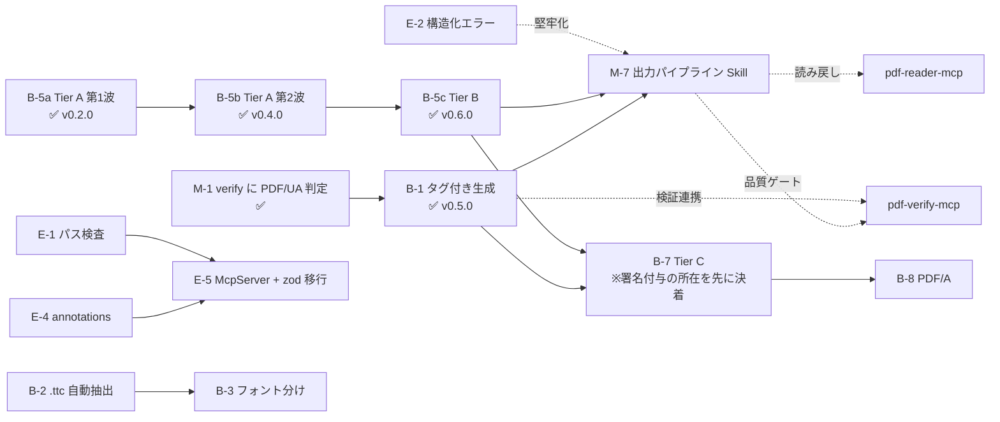

# pdf-writer-mcp 残タスクリスト

| 項目       | 内容                                                                                                                                                                                                                                                                                                                                                                                                                                                                                                                                                                                                                                                                                                       |
| ---------- | ---------------------------------------------------------------------------------------------------------------------------------------------------------------------------------------------------------------------------------------------------------------------------------------------------------------------------------------------------------------------------------------------------------------------------------------------------------------------------------------------------------------------------------------------------------------------------------------------------------------------------------------------------------------------------------------------------------- |
| 作成日     | 2026-07-16                                                                                                                                                                                                                                                                                                                                                                                                                                                                                                                                                                                                                                                                                                 |
| 最終更新   | 2026-07-20（v0.14.0 = B-14 + W-5 実装後）                                                                                                                                                                                                                                                                                                                                                                                                                                                                                                                                                                                                                                                                  |
| 基準       | `docs/DESIGN.md` §12（ロードマップ）／ `Document-Note/mcps/PDFfamily/specs/05-pdf-writer-mcp.md`（Tier 体系）／ `specs/06-family-implementation-standards.md`（共通実装規約）／ `specs/07-pdf-publish-skill.md`（出力パイプライン）／ `mcps/pdf-family-role-architecture.md`（責務分担提案）                                                                                                                                                                                                                                                                                                                                                                                                               |
| 現状       | create 系 3（**PDF/UA 対応**）+ 編集系 16 = **19 ツール**・テスト 25 ファイル・typecheck / biome OK。**v0.13.0**（2026-07-18・公開済み）= B-10a / B-10b / B-11 / B-13 / SPEC-AUDIT Phase 2・3・4。**Tier C は完了**（増分更新 7 ツール / ensure_tagged。B-7d は M-8 経路へ委譲）。**Issue #2 の 3 ハードルは全て達成済み → close 可能**。**2026-07-19: pdf-spec 0.4.4 正典で全ツール再監査済み**（`docs/SPEC-REAUDIT-2026-07-19.md`）— Phase 1〜4 の結論は維持・新規発見 5 件（下記 B-10b-fix / B-14 / B-15）。**v0.13.1**（2026-07-19・公開済み・npx 検証 PASS）= B-10b-fix（W-1 hotfix）+ carry 経路の qpdf 読み戻しテスト。**v0.14.0**（2026-07-20・**公開済み・npx 検証 PASS**）= B-14（W-2/3/4）+ W-5 |
| 次の最優先 | **B-17 は 2026-07-21 に修正済み（未リリース = 次版 0.14.1 候補）。** ホストでの `npm test` / typecheck / biome 待ち。次は **B-18 / B-19**（リフロー経路を採るかの判断 = `specs/14-reflow-placement.md` の決裁と連動）。**v0.14.0 公開済み・npx 検証 PASS**（3 経路 qpdf exit 0 / veraPDF 106-106 / poppler 警告消滅 / 旧版 0.13.1 とラスタライズがバイト一致）。**SPEC-REAUDIT の新規発見 5 件（W-1〜W-5）は全消化**。B-17 の次は、リフロー経路を採るかの判断待ちで **B-18 / B-19**。残る B-10c / B-12 / B-15 / B-4 / B-8 は急がない                                                                                                                                                                                                                                                                                                                                                                                       |

## 次にやること（2026-07-19 更新・SPEC-REAUDIT 反映）

### 0. ✅ B-10b-fix（W-1）= v0.13.1 hotfix（2026-07-19・公開済み）

**根拠と実測**: `docs/SPEC-REAUDIT-2026-07-19.md` W-1。`services/doc-level.ts` の
`carryXmp()` と汎用経路が、ref を `lookup()` で**解決してから**
`PDFObjectCopier.copy()` に渡していたため、返り値が**新しい間接参照ではなく複製オブジェクト実体**になり、
catalog の `/Metadata` に**ストリームが直接オブジェクト**として埋まっていた
（R-7.3.8.1-5「All streams shall be indirect objects」/ R-7.7.2-22 違反）。
出力は qpdf で **`unable to find /Root dictionary`（exit 2）** — 壊れた PDF。

- 対象: merge / split / extract / delete / reorder × 「準拠宣言（pdfuaid/pdfaid）を**含まない**
  XMP を持つ入力」。writer 自前の tagged 出力は宣言持ちで carry されないため内輪のテストでは踏まなかった
- **修正**: `copyForCatalog()` を新設し **ref のまま `copier.copy()` に渡す**
  （直接オブジェクト入力は `dst.context.register()` で間接に格上げ。carry する全キーで一貫）
- **テスト**: `doc-level.test.ts` に ① carry したキーが `PDFRef` であること
  ② **`qpdf --check` による独立実装での読み戻し**（extract / delete / reorder / merge の全経路）。
  qpdf 不在時はスキップ。修正を戻すと exit 2 で落ちることを実測済み
- **今回の本質はテストの是正**: 既存テスト「準拠宣言の無い XMP は引き継ぐ」は
  pdf-lib での読み戻しのみだったため緑を保っていた（pdf-lib は壊れた catalog を寛容に読み、
  `/Metadata` の存在を報告してしまう）。**委譲先の出力は独立実装で開く**
- 同乗させなかったもの: **W-5**（Info/XMP の日時を同一 `Date` に貫通。R-14.3.4-2/-5）。
  hotfix の差分を carry 経路に閉じるため次版へ送った
- 公開後の npx 検証（2026-07-19）: 手組みの「準拠宣言なし XMP を持つ外部 PDF 相当」入力で
  extract / delete / reorder / merge が全て qpdf exit 0・catalog `/Metadata` は間接参照。
  **同じ入力を公開版 0.13.0 に食わせると qpdf exit 2** で、
  破損が公開版に実在したことも公開版同士の比較で確認した

### 1. ~~reader の High バグ 2 件 + M-2~~ ✅ / ~~M-8~~ ✅ / ~~verify #4~~ ✅（2026-07-18〜19 に全て完了）

2026-07-18 起票時の「reader が先」の中身は**全部済んだ**: reader High-1/High-2 は修正済み・
M-8 `extract_structured_text` は reader v0.8.0〜v0.9.0 として公開済み・verify #4 `evaluate_policy` は
v0.7.0 として公開済み。spec ⇄ reader / spec ⇄ verify の相互監査も完了（各リポジトリの
reviews / docs 参照）。**writer の再監査（本リポジトリ `docs/SPEC-REAUDIT-2026-07-19.md`）で
family の「最新 spec で三方を再監査」は一巡した。**

### 2. ~~v0.13.1 の後の writer の進行順~~（2026-07-19 提案 → **1 = B-14 は v0.14.0 で完了**。残りは下記の順のまま）

全体計画（memory / specs/00 付記）は「**課題消化 → writer 完成 → family 連携使用 → 紹介サイト**」。
writer 側の推奨順:

1. **B-14（フォント埋め込みの条文適合 = 再監査 W-2/W-3/W-4）** — 全 create 系 + フォントを
   扱う編集系に効く既存出力の品質問題。B-2/B-3（フォント機能の拡張）に**先行させる**
   （拡張を先にやると違反経路が増えるだけ）
2. **B-10c**（構造木の引き継ぎ）— 引き金は従来どおり「pdf-publish が tagged 経路で
   ページ操作を挟みたくなったとき」。実装時は SPEC-REAUDIT の shall チェックリスト
   （ID 一意・RoleMap/ClassMap マージ・PageLabels index 0・OCGs 完全性）を受け入れ基準にする
3. B-12（`replace_text`）/ B-2（`.ttc`）/ B-3（フォント分け）/ B-4（画像）— 順不同。
   B-2 実装時は W-3/W-4 の是正を同時に満たすこと（SPEC-REAUDIT の B-2 節）
4. B-8（PDF/A）— pdf-spec のコーパス外（ISO 19005 なし）。検証手段の設計から必要

## SPEC-AUDIT の到達点（Phase 1〜4 完了 + **Phase 5 = 0.4.4 正典での再監査完了 2026-07-19**）

> Phase 5（全ツール再照合 + 未着手タスクの事前照合）は独立レポート
> **`docs/SPEC-REAUDIT-2026-07-19.md`** にある。結論: Phase 1〜4 は維持・新規 5 件
> （W-1 = B-10b-fix 🔴 / W-2〜W-4 = B-14 / W-5 = v0.13.1 同乗候補）。
> 教訓の追加分: **「無害」と分類した警告は条文で裏を取るまで無害ではない** /
> **読み戻しは独立実装（qpdf --check）で**。

**正典が変わった。** pdf-spec-mcp が **0.4.1** になり、抽出が大きく直った。
**`docs/SPEC-AUDIT.md` の冒頭の警告を必ず読むこと** — Phase 1 / 1.5 は欠けた正典に対して
行われていた（Table 166 は 16/19 行、Table 182 は QuadPoints 行が欠落、
`get_requirements` は表の shall を 1 件も返さなかった）。

**再照合の結果（Phase 2〜4・v0.13.0 で是正済み）**:

- **Phase 1 / 1.5 の結論はほぼ無傷**だった（欠けていた Table 166 の 4 行は全て Optional / PDF 2.0）。
  **危なかったのは「探していない領域」の方** — 表由来要件の走査で **shall 違反 3 件**を発見:
  ①注釈テキストの段落区切りが LF（§12.5.6.2）②添付 `/Params` の日時が PDF 生成時刻
  （Table 45 / §14.13.2）③`/DA` のフォントが `/DR` から解決できない（§12.7.4.3）
- **3 件の共通点**: いずれも **pdf-lib に委譲した部分の中身を一度も開いていなかった**。
  veraPDF も既存テストも委譲先が書いた辞書を見ない。
  → **鉄則: 委譲先が書いた辞書は一度は自分の目で開く**
- 残りは低優先（reader の観測ロジック照合 / verify native 規則 / create 系レイアウト）。
  SPEC-AUDIT「未実施（Phase 5 以降）」参照

### pdf-spec を使うときの注意（0.4.1 時点）

- 🔴 **`search_spec` の section は信用しない**（pdf-spec の S-8・未修正）。ページ単位で索引し、
  ページ全体を「そのページ以前に始まる最後のセクション」に帰属させるため、**ページ上端に残った
  前セクションの内容は必ず誤帰属する**。実例: `search_spec("QuadPoints")` →「12.5.6.11 Caret
  annotations」（正しくは 12.5.6.10 の Table 182）。**当たりを付ける用途に留め、get_section /
  get_tables で裏を取る**
- `list_specs` の `coverage` を見ること。**PDF/A（ISO 19005）と PAdES（ETSI EN 319 142）は
  コーパスに無い**。それらの検索が 0 件でも「要件が無い」ではなく「答えられない」
- ヘッダなしの表は分裂して返る（S-4・5 セクション）。内容は `get_section` から見える

### 鶏卵ではない

pdf-spec の正しさは reader ではなく **PDF の直接観測**（生ページ・全数差分・変異）で担保されている。
`spec → reader / verify / writer` は接地点のある一本の鎖であって循環しない。
ただし「同じ PDF を読んで pdf-spec と reader が一致するか」という**狭い相互チェック**には価値があり、
それは pdf-spec の S-4（ヘッダなしの表 = StructTree の読み方）に着手するときに行うのが自然。

## 現状サマリ

- ✅ create 系（Tier 0）: `create_text_pdf` / `create_markdown_pdf` / `create_table_pdf`（`tagged: true` で PDF/UA-1）
- ✅ 編集系 Tier A: `set_metadata` / `merge_pdfs` / `split_pdf` / `extract_pages` / `delete_pages` / `reorder_pages` / `rotate_pages` / `add_bookmarks` / `add_annotation`
- ✅ 編集系 Tier B: `attach_file` / `add_watermark` / `stamp_page_numbers` / `fill_form` / `flatten_form`
- ✅ 日本語フォント埋め込み（**harfbuzz 事前サブセット + subset:false**。ADR-7 / ADR-8）
- ✅ グリフ欠落ポリシー（`onMissingGlyph`: error / replace / ignore）
- ✅ 署名ガード（`/ByteRange` 検知 → 既定エラー）
- ✅ vitest 18 ファイル（validation / layout / generate / extract / **render** / glyph / editor / page-spec / outline-annotation / tagged / struct-append / attachment / watermark / page-number / form / **registry** / errors / deterministic）
- ✅ コード衛生・family 整合 E-1〜E-6（v0.7.0）: McpServer + Zod・構造化エラー・パス検査・stdout ガード・annotations・決定論的出力
- ✅ CI（typecheck + test、日本語フォント取得込み）・npm Trusted Publisher 公開

## A. 運用系

- [x] **A-1. docs のコミット & push**（2026-07-16）
- [x] **A-2. CI 整備（GitHub Actions）** — typecheck + vitest（Node 20/22）+ build。Noto Sans JP を取得し `TEST_FONT_PATH` を設定
- [x] **A-3. npm 公開** — v0.3.1 公開済み（Trusted Publisher / OIDC・provenance 付き）
- [x] **A-4. コミット署名の運用決定**（2026-07-18 決定）— **方針②を採用**。
      **push は必ず手元（shuji）が行う**という前提のもと、**タグと同期するコミットだけを
      `git commit --amend -S` で署名する**。
      AI はサンドボックスから未署名でコミットしてよい（署名鍵は手元のみ・identity は
      `-c user.name/user.email` で既存 author を引き継ぐ）。

      ### 🔴 鉄則: 署名は **push・tag の前**。push 済みには絶対に amend / rebase しない

      **手順**（この順を崩さない）:
      1. AI が未署名でコミット
      2. **手元で `git commit --amend -S --no-edit`（push 前・tag 前）**
      3. `git push` → `git tag vX.Y.Z` → `git push origin vX.Y.Z`

      **v0.13.0 で実際に踏みかけた**（2026-07-18・記録として残す）:
      リリースコミット `d6bebf9` を push・tag・publish した**後**に署名しようとして
      `git rebase --exec 'git commit --amend -S' -i d6bebf9^` を実行 → ハッシュが `2354da8` に
      変わり **main が origin/main と分岐**した（ahead 2 / behind 1）。
      ここで force push していたら、**npm provenance が指す `d6bebf9` が main の履歴から消えていた**。
      なお `2354da8` の tree は `d6bebf9` と**完全に同一**（署名し直しただけ）で、
      公開履歴を書き換える価値は無かった。

      **復旧**（force push せずに解決できる）:
      ```
      git rebase --onto origin/main <署名し直したコピー> main   # 後続コミットだけを載せ直す
      git push                                                  # fast-forward
      ```
      署名し直したコピーはどのブランチからも参照されなくなり reflog に残るだけ。実害ゼロ。

      **v0.13.0 のリリースコミットは未署名のまま確定**（窓が閉じた後だったため）。
      署名は v0.13.1 以降から。**AI はこの手順を破る提案をしないこと** — 実際に破った。

- [ ] **A-5. 壊れたバージョンの deprecate** — 手元での実行待ち（下記コマンド）。0.2.0 の deprecate 文が「0.3.0 以降を」と壊れた版を案内しているため要修正
- [x] **A-6. biome 導入**（2026-07-16）— verify と同じ設定・スクリプトを追加し CI/publish に `npm run check` を組み込み。既存コードも整形済み（指摘 0）。あわせて verify の biome 版不整合（`^2.3.14` 指定 × 実体 2.5.4）を解消し、両リポジトリとも **2.5.4 に固定**（整形結果は minor 更新で変わるため、キャレット指定は手元と CI のズレを生む）

## B. 機能系

> 優先順位メモ（2026-07-16）: DESIGN.md 旧版は「タグ付き PDF が優先1位」としていたが、
> **verify 側に PDF/UA 判定が無く受け入れ基準を機械検証できない**ため、
> Tier A 編集系を先行する方針に変更済み（`mcps/pdf-family-role-architecture.md` M-1 参照）。

- [x] **B-5a. 編集系 Tier A 第1波**（v0.2.0）
- [x] **B-5b. 編集系 Tier A 第2波**（v0.4.0）: `add_bookmarks` / `add_annotation`
- [x] **B-5c. 編集系 Tier B**（完了・子項目 5 件すべて済み）
  - [x] `attach_file`（v0.6.0・2026-07-16）— `/Names /EmbeddedFiles` + catalog `/AF` + `/AFRelationship`。
        PDF/A-3（ISO 19005-3）§6.8 準拠の形。`relationship` 省略時は Unspecified になるため警告する。
        MIME は拡張子から推定、同名は拒否（名前ツリーのキーは一意）、タグ付き PDF に添付しても veraPDF ua1 は COMPLIANT。
        pdf-lib の `attach()` が catalog /AF・/UF・/Params まで書くことを実測で確認済み（自前実装は不要だった）
  - [x] `add_watermark`（2026-07-16）— 中央に斜めの透かし。`text`/`fontSize`/`color`/`opacity`/`angle`/`behind`/`pages`。
        タグ付き PDF では `markArtifactOnPage` で Artifact 化し、veraPDF ua1 106/106 COMPLIANT を維持することを確認済み。
        背面配置は pdf-lib が追記しかできないため、描画後に `/Contents` 配列の末尾（＝透かし）を先頭へ移して実現している
        （`watermark.ts` の `moveLastToFront`）。各ストリームが q/Q で自己完結しているため順序入替は安全。
  - [x] `stamp_page_numbers`（2026-07-16）— `{n}`/`{total}` 書式・6 箇所の配置・`pages`/`startAt`（表紙除外）。
        **タグ付き PDF では Artifact 化**して veraPDF ua1 の COMPLIANT を維持（7.1-3）。
        ページ回転（/Rotate）を補正。**編集系で初めてフォントを扱う**ツールで、create 系と同じ font-manager を通す
        （harfbuzz サブセット・グリフ検査がそのまま効く）。
        副産物: `parsePageSpec` が開端指定（1 ページ文書への `"2-"`）を「範囲外」でなく「逆順」と誤報していたのを修正
  - [x] `fill_form` / `flatten_form`（2026-07-16）— AcroForm。text / checkbox / dropdown / optionlist / radio。
        Widget は Annot ではなく **Form** タグに入る（PDF/UA-1 7.18.4）。記入は構造木に触らないため準拠は
        入力から引き継がれる（テストで固定）。flatten はタグ付きでは既定で拒否（veraPDF で 7.1-3 違反を確認済み。
        `allowBreakingTags: true` で強行可）。
        **pdf-lib のバグ回避**: `PDFForm.flatten()` は `/Annots` から「外観ストリームの参照」しか消さないため、
        `addToPage` が作った Kid ウィジェットの参照が宙吊りで残り poppler が `Invalid XRef entry` を出す。
        `pruneDanglingRefs`（form.ts）で掃除している。
- [x] **B-1. タグ付き PDF / PDF/UA-1**（v0.5.0・2026-07-16）
  - **受け入れ基準を達成**: veraPDF `--flavour ua1` で **106/106 規則・違反 0（COMPLIANT）**。text / markdown / table の 3 ツールすべて
  - `tagged: true` で opt-in（既定の出力は不変）。PDF/UA はタイトル必須のため `title` が必要
  - 構造木（StructTreeRoot / StructElem / ParentTree）・BDC/EMC・Artifact・XMP（pdfuaid + 拡張スキーマ）・/Lang・DisplayDocTitle
  - Markdown → 構造タグ（H1-H6 / L・LI・LBody / Table・TR・TH(+/Scope)・TD / BlockQuote / Code）
  - 見出しレベルの正規化（H1 始まり・飛ばさない。`# → ###` は `H1 → H2`）
  - `lang` 省略時は本文から推定し warnings で報告（かな→ja / ハングル→ko / 漢字のみ→ja だが中国語の可能性を警告）
  - **副産物のバグ修正**: 箇条書きの `•` が .notdef（豆腐）だった（v0.3.0 の回帰）。
    サブセットは入力テキスト基準だが、レンダラは入力に無い文字を足すため漏れていた。
    veraPDF の 7.21.8-1 が発見。抽出は正常だったため既存テストでは検知不能だった
  - 残課題（別タスク化）: 画像の Figure + /Alt（→ B-4）
- [x] **B-1b. タグ付き出力での注釈の Annot タグ内包**（v0.5.1・2026-07-16）
  - PDF/UA 7.18.1-1（Annot タグ内包）/ 7.18.3-1（/Tabs = /S）に対応。
    タグ付き PDF に注釈を追加しても **veraPDF ua1 で 106/106 COMPLIANT を維持**
  - `services/struct-append.ts` を新設（既存構造木への**追記**担当。struct-tree.ts はゼロから**構築**担当）。
    ParentTreeNextKey の読取・番号ツリーへの昇順挿入・/StructParent の書き戻しを実装 → **Tier C の ensure_tagged の足がかり**
  - `add_annotation` に `alt` を追加。タグ付き文書で未指定なら warnings で報告
  - タグ無し文書には構造木を作らない（注釈のためだけにタグ付けを始めない）
- [ ] **B-2. `.ttc` フェイス自動抽出** — Node 単体で完結（現状は検知してエラー）
- [ ] **B-3. 見出し / 本文のフォント分け** — 太字フェイス埋め込み。制約「インライン装飾は字面のみ」の解消
- [x] **B-6. `tag_form_fields`（タグ付きフォームの修復）**（v0.8.0・2026-07-17）- `7.18.4-1` Widget を **Form** 構造要素に内包（`struct-append.ts` の機構を `Annot`/`Form` に一般化）- `7.18.3-1` ページ辞書に `/Tabs S` - `7.18.1-3` フィールドに `/TU`（`labels` で人間可読名を指定。未指定はフィールド名で代用し警告）- 冪等（/StructParent 持ちはスキップ）。pdf-lib の /Kids 形とマージ形の両 Widget に対応。
      タグ無し文書は拒否（ゼロからのタグ付けは create 系 tagged / Tier C ensure_tagged の領分）- **veraPDF 実測**: 修復前は 7.18.1-3/7.18.3-1/7.18.4-1 のみ違反 → 修復後 **COMPLIANT (106/106)** - 副産物: `tagged: true` × 標準フォントは 7.21.4.1-1 で必ず違反になることが判明 →
      create 系に警告を追加（フォント埋め込みが PDF/UA の必要条件）

- [ ] **B-4. 画像埋め込み・ヘッダー / フッター**（ページ番号は B-5c の `stamp_page_numbers` に統合）
- [x] **B-7. Tier C**（**完了** v0.9.0〜v0.12.0。B-7d は M-8 経路へ委譲）— pdf-engine-core と合流。
      技術的ハードルの整理は [Issue #2](https://github.com/shuji-bonji/pdf-writer-mcp/issues/2)。
      決着（2026-07-17）: **署名付与は別 MCP（pdf-signature-mcp）に決定**（specs/05 §7-3）。
      エンジン言語は **TS（writer 内 PoC）で確立**（ADR-11）。
  - [x] **B-7a. 増分更新 PoC = 署名保持の注釈追加**（v0.9.0・2026-07-17）—
        `add_annotation` に `preserveSignatures`。`services/incremental.ts`（読み = pdf-lib /
        追記 = 自前。xref テーブル・ストリーム両対応）。Issue #2 のマイルストーンを実測達成:
        実署名（CMS）PDF への追加後、verify_signatures = **VALID**・verify_integrity =
        **合法な増分更新 1 件**・qpdf --check クリーン。
        副産物: pdf-lib が容器ストリームを登録しない採番落とし穴を発見（CLAUDE.md 落とし穴 7）。
        **pdf-spec-mcp による条文照合済み → 是正は v0.9.1**（§7.5.6 / §7.5.5 / §7.5.8.1 適合を確認。
        照合で発見した 2 件を v0.9.1 で是正: §14.4 の ID 第 2 要素更新（shall）、
        §12.8.2.2 の DocMDP P<3 拒否ガード。CHANGELOG 0.9.1 参照）
  - [x] **B-7b. 増分更新の展開（第1弾）**（v0.10.0・2026-07-17）—
        `preserveSignatures` を **set_metadata / add_bookmarks** に展開（共通ヘルパ
        `saveWithPreservedSignatures` / `assertDocMdpAllows` / `touchModificationDate`）。
        **§7.5.6 trailer 全エントリ引き継ぎ**を実装（PDFObjectParser で前 trailer を自前パース、
        除外 = 位置依存 + 再計算キー）。実測: 実署名 PDF への 2 段増分（メタデータ → しおり）で
        verify_signatures = **VALID**。DocMDP はメタデータ・しおり変更を全レベルで拒否（§12.8.2.2）
  - [x] **B-7b'. タグ付き文書の増分対応 = dirty 追跡の一般化**（v0.11.0・2026-07-17）—
        `struct-append.ts` が変更した既存オブジェクト（StructTreeRoot / 親要素 / ParentTree
        ないし /Nums 保持オブジェクト / page(/Tabs)）を `dirtiedRefs` として報告し、
        増分更新が正確にそれらを再定義する。`add_annotation`（タグ付き可）と
        **`tag_form_fields` の preserveSignatures** を実現。
        実測: タグ付き + 増分注釈 / 増分フォーム修復とも veraPDF ua1 **COMPLIANT (106/106)**・
        実署名回帰 **VALID**・重ね掛けで ParentTreeNextKey 連番維持。
        **この dirty 追跡が ensure_tagged（B-7c）の土台になる**
  - [x] **B-7b''. 増分更新の展開（完了）**（v0.12.0・2026-07-17）—
        `attach_file` / `stamp_page_numbers` / `add_watermark` に `preserveSignatures` を展開。
        dirty 追跡ヘルパを 2 形態ぶん追加: `pageContentDirtyRefs`（/Contents 配列・/Resources は
        pdf-lib が page 辞書へ正規化する）と `catalogNamesDirtyRefs`（/Names /EmbeddedFiles・/AF）。
        DocMDP: 描画追記・添付は全レベルで拒否（`assertDocMdpAllows` に 'content' を追加）
  - [x] **B-7c. `ensure_tagged`**（v0.12.0・2026-07-17）— `services/ensure-tagged.ts`。
        タグ付き文書は構造木を温存して文書要件のみ補修、タグ無し文書は最小構造木
        （Document > P × ページ・BDC/EMC で内容を包む）を新設。
        実測: タグ無し 2 ページ文書 → veraPDF ua1 **COMPLIANT (106/106)**。
        **設計判断**: 内容を Artifact で包む案（veraPDF は通る）は却下 — 本文が AT から
        隠れる「準拠の体裁だけ」の嘘になるため。P なら少なくとも読み上げられる。
        足場に過ぎないことを warnings で明示する（見出し・表・読み順・代替テキストは作れない）
  - [~] **B-7d. `edit_text`** → **M-8 経路へ委譲（不採用ではない）**（2026-07-17 決定）
    条文照合（pdf-spec-mcp）と Issue #2 の再読で三方から裏が取れた: 1. **仕様**: リフローは可能。§14.8.1 は "Automatic reflow of page contents" を
    **Tagged PDF の意図された用途として明記**し、§14.8.2.5 は logical content order を
    「構造木の深さ優先走査」で定義（shall）、§14.8.2.6.2 は「repurposing tool が行分割を
    決められるだけの情報がある」ことと単語区切りの空白（shall）を保証する。
    **リフロー = 元レイアウトの再現ではなく「論理順序を保った新規レイアウト」**であり、
    元の折り返し規則は不要。ただし**タグ無し文書では logical order を導出できず推測になる** 2. **Issue #2 の射程外**: #2 が定義した分水嶺は ①Xref のバイトオフセット ②ByteRange を
    侵さない注釈追記 ③タグ木への外科的挿入 の 3 つで、**すべて v0.9.0〜v0.12.0 で達成済み**。
    本文編集は #2 に一度も登場しない（#2 は close 可能）3. **実装経路**: writer にコンテンツストリームパーサは**不要**。reader が既に pdfjs を持ち、
    MCID↔テキストの対応も解けている（`extract_tables` が実証）。**reader に構造付きテキスト
    抽出（M-8）を足せば、reader → Skill → writer の create 系再生成で成立する**
    → よって writer 側の残作業は **replace_text（見た目保存型・リフローしない限定置換）のみ**。
    これは Tier C ではなく **Tier B 相当の軽量機能**（B-12 として別掲）
- [ ] **B-10. ページ操作系の文書レベルオブジェクト引き継ぎ**（SPEC-AUDIT Phase 1.5 で発見。現在の 🔴 は下の **B-10b-fix**）
      `copyPages` を使う 5 ツール（merge / split / extract / delete / reorder）が
      **StructTreeRoot / MarkInfo / Metadata(XMP) / Names(添付) を黙って破棄**している（実測）。
      rotate は in-place のため無傷。仕様違反ではない（タグ無し PDF は合法）が、
      **「壊すなら明示する」という writer の原則に対する内部不整合**であり実害が大きい:
      PDF/UA 準拠が消える / PDF/A-3 添付（電帳法データ）が消える / B-9 の Info↔XMP 整合が逆流 /
      pdf-publish が「create(tagged) → extract → verify」で COMPLIANT を落とす。
  - [x] **B-10a. 警告を出す**（2026-07-18・未リリース）— `services/doc-level.ts`。
        入力 catalog を採取（`surveyDocLevel`）し、**出力を実測して**失われたものだけを warnings で報告する
        （`docLevelLossWarnings`）。「copyPages は落とす」を前提に焼き込まないので、
        **B-10b で引き継ぎを実装すれば警告は自動で消える**（かつ「引き継いだのに警告する」退行も
        `doc-level.test.ts` が防ぐ）。
        対象は Table 29 の 13 要素（tagged / XMP / 添付 / AF / AcroForm / OCProperties /
        OutputIntents / Outlines / Lang / ViewerPreferences / PageLabels / Dests / OpenAction）+
        細かなエントリのまとめ報告。ツール説明にも制約と復旧手段を明記。
        **条文照合で 1 件格上げ**: `/OCProperties` の消失は「損失」ではなく**仕様違反になりうる** —
        §8.11.4.2「This dictionary shall be present if the PDF file contains any optional content」
        （R-8.11.4.2-2）。複製ページが OC を使っているかを実測（`usesOptionalContent`）し、
        使っていれば shall 違反として報告する。
        副産物: 監査は 4 要素（StructTreeRoot / MarkInfo / XMP / Names）を挙げていたが、
        **/AcroForm（Widget が孤児になりフォームが機能しなくなる）と /OCProperties も落ちていた**
  - [x] **B-10b-fix 🔴（W-1）**（2026-07-19・**v0.13.1**）: carry が XMP ストリームを catalog に
        **直接オブジェクト**で埋め込み、**出力 PDF を破壊していた**（v0.13.0 リグレッション。
        qpdf が /Root 解決不能 = exit 2）。原因 = ref を `lookup()` で解決してから
        `PDFObjectCopier.copy()` に渡していた（copy は**渡された型と同じ型を返す**ため、
        新しい ref ではなく複製された実体が返る）。是正 = `copyForCatalog()` を新設し、
        **ref は ref のまま copy に渡す**（直接オブジェクト入力は `register()` で間接に格上げ）。
        R-7.3.8.1-5 / R-7.7.2-22。
        **テスト側の是正が本体**: 既存テスト「準拠宣言の無い XMP は引き継ぐ」は
        **pdf-lib での読み戻しのみ**で緑を保っていた（pdf-lib は壊れた catalog を寛容に読む）。
        `qpdf --check` による**独立実装での読み戻し**を carry 全経路に追加し、
        修正を戻すと exit 2 で落ちることを実測（[[green-tests-can-be-vacuous]] の再演）。
        qpdf 不在環境ではスキップ
  - [x] **B-10b. 引き継ぎ**（2026-07-18・未リリース）— `carryDocumentLevel`（doc-level.ts）。
        複製は pdf-lib の `PDFObjectCopier` に委譲（参照グラフを辿るので添付ストリームも 1 回で運べる）。
        **選定基準を「引き継げるか」→「引き継いで嘘にならないか」に改めた**（起票時の計画は誤りだった。
        SPEC-AUDIT の IMPORTANT 参照）: - 引き継ぐ: **`Names`/EmbeddedFiles + `AF`（＝電帳法データが生き残る・最大の収穫）**・
        `Lang`・`ViewerPreferences`・`OutputIntents` - `Metadata`(XMP) は**準拠宣言（pdfuaid/pdfaid）を含まない場合のみ**。含む場合は運ばない —
        **偽の準拠主張は準拠の消失より有害**（宣言があると veraPDF がその flavour で検証して落ちる）- **`MarkInfo` は運ばない** — 構造木が無いのに「タグ付きだ」と名乗る嘘になる - `AcroForm` / `OCProperties`（参照の張り替えが要る）と `PageLabels` / `Dests` /
        `OpenAction` / `Outlines`（**ページ番号・ページ参照に依存**）は B-10c 以降 - merge は**先勝ち**。採らなかったものは `firstWinsWarning` が**ファイル名を名指しで**報告する。
        当初「B-10a の警告が実測して報告する」と書いたが**誤り**だった — 警告は「機能が出力にあるか」
        しか見ないので、入力 1 の添付が運ばれれば入力 2 の添付が消えても黙る（機能単位であって
        ファイル単位ではない）。**引き継ぎを増やしたせいで警告が消える退行**を作りかけた - **未了**: 添付の**本当のマージ**（名前衝突の解決込み。起票時の計画にあった）は B-10c 以降
  - [ ] **B-10c. 構造木の引き継ぎ** — extract/delete/reorder は「残ページ分の構造要素」の再構築が要る。
        merge は ParentTree のキー空間統合が要る。重いので b の後に判断。
        **これが入ると MarkInfo と準拠宣言つき XMP も運べるようになる**（嘘でなくなるため）。
        `AcroForm` / `OCProperties` の参照張り替えも同じ回で扱うのが自然
- [x] **B-13. `rotate_pages` が Claude Desktop から呼べない**（2026-07-18・B-10a の試用中に発見／未リリース）
      症状: `rotation: 90` を渡すと**必ず** `invalid_union` で失敗し、どう呼んでも成功しない。
      **writer 側に非は無かった** — `dist/index.js` を直接 spawn して `tools/list` を叩いた結果、
      サーバは `anyOf: [{type:number, const:90}, ...]` を**正しく公開していた**
      （SDK 1.29.0 は `zod/v4-mini` の `toJSONSchema` を `target: 'draft-7'` で呼ぶ。これも正常）。
      **anyOf を落として型を見失い、文字列 `"90"` を送っていたのはクライアント側**。
      実行時 zod は正しく弾いていた（＝ガードは機能していた）。
      対応: それでも rotate_pages が使えない事実は残るため、`z.literal([90, 180, 270])` に変更し
      **平坦な `{type:'number', enum:[90,180,270]}`** を公開する。anyOf を経由しないので
      当該クライアントでも型が見える。**意味は等価**（値の列挙は本来 enum で表すのが自然）で、
      実行時の厳格さも不変（`"90"` は引き続き拒否 — `validation.test.ts` で境界を固定）。
      `fill_form` の `z.union`（値 = string|number|boolean|string[]）は**本物の異種型 union** で
      anyOf が正しい表現、かつプロパティ自体は `type:'object'` を持つため対象外。
      **なぜ検知できなかったか**: `registry.test.ts` はツール名・必須フィールド・annotations しか
      見ておらず、プロパティのスキーマ本体を検査していなかった。
      **ただし当初考えた「全プロパティが type/enum/anyOf を持つ」という不変条件では捕まらない**
      （修正前も anyOf はあった）。実際に足した回帰は
      「**const だけで構成された anyOf を公開しない**（＝ enum で書けるものを anyOf にしない）」。
      教訓: **誤診しかけた** — `z.toJSONSchema` を既定 target で試して「SDK が anyOf を落とす」と
      断定したが、SDK の実際の呼び方（draft-7）を確認していなかった。
      層をまたぐ不具合は**各層に実際に何が渡っているかを 1 つずつ観測する**こと
- [x] **B-11. DocMDP コメントに DSS/DTS 例外を明記**（2026-07-18・未リリース）— verify #5 の指摘を
      条文で裏取りし、**そのとおりだった**。しかも例外は **P の全値に効く** —
      Table 257 の `P` 行が選択肢の列挙より**前**に「DSS / DTS の追加に必要なデータのみを含む
      増分更新は文書への変更と**みなしてはならない**」（R-12.8.2.2.2-5・shall not）と置いている。
      P=1 の本文も "any changes shall invalidate the signature **with the exception of subsequent
      DSS and/or document timestamp incremental updates**"（R-12.8.2.2.1-6）と明示。
      writer は DSS/DTS を書かないため実害は無いが、**family 内で解釈がずれると trust の判定が割れる**
      ため `assertDocMdpAllows`（editor.ts）に明記した。コードの挙動は変えていない
- [ ] **B-12. `replace_text`（見た目保存型の限定置換）** — B-7d の分割で残った軽量機能（Tier B 相当）。
      既存 Tj/TJ の文字列を**同じフォントで差し替える**のみ。リフローしない・座標を変えない。
      幅が変わる場合は警告（または拒否）。実需: 請求書の日付・版番号・氏名の差し替え。
      **リフローが要るなら M-8 経路（reader → Skill → create 系再生成）を使う**、と説明で誘導する。
      難所: Tj のコード列 → 文字の逆引き（標準フォント = WinAnsi は容易 / Identity-H は ToUnicode 経由）
- [x] **B-14. フォント埋め込みの条文適合**（2026-07-19 起票 → **2026-07-20 完了・v0.14.0 公開済み**。
      詳細・実測証拠は `docs/SPEC-REAUDIT-2026-07-19.md`。実装は `services/font-conformance.ts` で、
      **`doc.save()` の直前**に pdf-lib が書いた辞書を開き直して是正する）
  - [x] **W-2 🔴**: CFF (.otf) が **CIDFontType2 + FontFile2** で埋め込まれていた（実測: ストリーム先頭
        `OTTO`）。Table 124（R-9.9.1-33/-34）違反 — FontFile2 は TrueType program（glyf/loca 必須）。
        是正: **CIDFontType0 + FontFile3 `/Subtype /OpenType`**（cmap の有無を実測して確認。
        無ければ触らず報告）＋ `/CIDToGIDMap` 削除（Table 115 で CIDFontType2 専用）。
        **想定外の難所 = グリフ選択**: CIDFontType0 は `CID → charset → GID`（R-9.7.4.2-4）で
        CIDFontType2 の `CID → GID` とは別経路。CID-keyed CFF をサブセットすると charset は
        「新 GID → 元の GID」を保つ（実測: gid1→cid1, gid2→cid18, … gid9→cid1478）ので、
        **辞書名だけ直すと条文どおりに解決する処理系が別のグリフを描く**。
        CFF の charset を identity に書き換えて解決（ROS が `Adobe-Identity-0` = CID に外部
        コレクション上の意味が無いことを確認してから。バイト長不変。sfnt チェックサムは再計算）。
        **受け入れ確認: poppler の `Mismatch between font type` 警告が消滅**（実測）
  - [x] **W-3**: サブセット名に `ABCDEF+` タグが無かった（実測 `/NotoSansJP-Regular-7572`）。
        R-9.9.2-2/-3。タグは**フォントプログラムのハッシュ**から決めるので決定論的出力（E-6）を
        壊さない。pdf-lib の乱数サフィックスは「元の PostScript 名」を壊すので落とす
  - [x] **W-4**: FontFile2 に `Length1` が無かった（Table 125 で TrueType は Required）。
        .otf は W-2 是正後 FontFile3 になるため、**残るのは .ttf 入力経路**。実測で一致を確認
  - [x] **W-5**（同乗）: Info と XMP の日時が別々の `outputDate()` 呼び出しだった
        （R-14.3.4-2/-5 の「fully equivalent」を秒境界で破りうる）。`documentDate(doc)` で
        **1 文書 = 1 インスタンス**に一本化
  - **テストの教訓**: 検査は全て **qpdf / poppler での読み戻し**（pdf-lib は自分が書いた辞書を
    そのまま読み返すので、この層の誤りを原理的に検出できない）。なお初版のテストは
    `skipIf` の条件を `beforeAll` で立てたフラグにしていたため**全 7 件がスキップされたまま緑**
    だった（`skipIf` は定義時に評価される）。同期検出に変更済み。
    修正を外すと 8 件中 6 件が落ちることも実測

- [ ] **B-15. `fill_form` への preserveSignatures 展開**（2026-07-19 起票・機能ギャップ）
      R-12.8.2.2.1-7: DocMDP **P≥2 はフォーム記入を明示的に許す**のに、増分更新を持たない
      fill_form では署名済みフォームに記入できない（署名ガードで拒否）。B-7b'' のヘルパで
      成立するはず。違反ではないが、「署名済み申請書に記入して返す」という実需の中心
- [ ] **B-8. PDF/A 変換** — 外部ツール連携検討。**ISO 19005 は pdf-spec のコーパスに無い**ため
      条文照合ベースの受け入れ基準が作れない（検証手段の設計から必要。SPEC-REAUDIT B-8 節）。
      ※サブセット名正規化は B-14/W-3 へ移動（32000-2 本体の義務のため PDF/A を待たない）
      ※旧番号 B-6（B-6 が `tag_form_fields` と重複していたため 2026-07-17 に改番）
- [ ] **B-16. PDF 2.0 出力対応時の必須項目メモ**（起票のみ）— Table 15: trailer `/ID` は
      **PDF 2.0 で Required**（各バイト列 16 バイト以上・初回は両要素同値 = R-14.4-6）。
      現状の 1.7 出力では不書きで適合（実測: create 系は /ID を書かない）。
      2.0 対応時は E-6 決定論と `SOURCE_DATE_EPOCH` 由来ハッシュで両立させる
- [x] **B-9. set_metadata の XMP 併記更新**（v0.10.0・2026-07-17）— `syncXmpWithInfo`（xmp.ts）。
      Info の現在値から XMP を再生成し、pdfuaid:part / dc:language / xmp:CreateDate は既存から保持。
      **同一 ref への assign** で差し替えるため catalog 不変（増分更新と両立）。
      dc:description（Subject）と pdf:Keywords を XMP 生成器に追加。
      実測: タグ付き文書のタイトル変更後も veraPDF ua1 **COMPLIANT (106/106)**

### ④ 実連携（2026-07-20 起票）— リフロー経路の往復が閉じない

出典: `Document-Note/mcps/PDFfamily/specs/11-kickoff-measurements.md` §3。
④ で「writer で書く → reader `extract_structured_text` で読み戻す」を回したところ、
**往復が不動点にならない**ことが 3 件出た。M-8 は「リフローは reader→Skill→writer で
やる」と決めた経路なので、**writer 側が情報を落とすと経路そのものが成立しない**。

- [x] 🔴 **B-17. `stripInline` の `_` 処理が CommonMark に反し、`snake_case` を破壊する**（2026-07-21 修正・未リリース）
      **修正**: ① コードスパンを先に退避してから装飾処理（復元は最後）。プレースホルダは
      NUL 挟みにして本文の「空白 + 数字 + 空白」を巻き込まないようにした。
      ② `_` / `__` の除去を `stripUnderscoreEmphasis()` に分離し、**開始の直前と終了の直後が
      語構成文字なら強調とみなさない**。判定は `/[\p{L}\p{N}_]/u` で **ASCII に限定しない** —
      changelog 0.17 が「ASCII 英数だけを見ていたためキリル文字の語中 `_` を誤判定した」と
      記しており、同じ理由で日本語の識別子も壊れるため。`*` の挙動は変更なし。
      **設計方針**: flanking の完全実装ではなく保守的な近似。取りこぼすと `_` が字面に残るだけで、
      逆（強調でない `_` を消す）は文字の欠落になる。**残る側に倒す**。
      **テスト**: `tests/strip-inline.test.ts`（16 ケース）。`stripInline` を export した。
      **負の対照実測**: 修正前の実装に同じ 16 ケースを通すと **6 件が落ちる**
      （snake_case 2 / 日本語識別子 / キリル文字 / コードスパン保護 / `__foo_bar__`）
      <details><summary>起票時の記録</summary>
      `services/renderers/markdown.ts` の `stripInline()` は
      `.replace(/__([^_]+)__/g,'$1')` と `.replace(/_([^_]+)_/g,'$1')` を
      **左右の文字を見ずに**適用する。CommonMark は `*` の語中強調は許すが `_` は許さない
      （`snake_case` を守るための規則）。writer は両者を同一に扱っているため、
      1 行に `_` が偶数個あると識別子が壊れる。
      **`exit 0`・`warnings` なしで起きる**ため、読み戻して入力と照合しない限り気づけない。
      さらに**バッククォートで囲んでも防げない** — コードスパンの復元（line 27）が
      `_` の処理（line 26）より**後**にあるため、利用者側の回避手段が無い。
      実測（`_pdf-family-e2e/r1-repro.pdf`・v0.14.0）:

      | 入力 | 出力 | 判定 |
      |---|---|---|
      | `a_b`（`_` 1 個） | `a_b` | 保存される |
      | `identify_conformance and validate_conformance` | `identifyconformance and validateconformance` | **破壊** |
      | `` `identify_conformance` and `validate_conformance` `` | 同上 | **破壊**（コードスパン無効） |
      | `extract_structured_text` | `extractstructuredtext` | **破壊** |
      | `*emphasised*` | `emphasised` | 正常（機能自体は動く） |
      | `foo*bar*baz` | `foobarbaz` | `*` の語中強調は CommonMark でも有効 = 正 |

      **修正方針**: `_` の開始・終了判定に CommonMark の left/right-flanking 条件を入れる
      （最小実装なら「前後が英数字なら強調とみなさない」）。あわせてコードスパンを
      先に切り出して保護する。**着手時に CommonMark §6.2 の条文を必ず引くこと** —
      本起票時は spec ページの当該節本文を取得できておらず、規則の要旨のみで書いている
      （一次情報未確認）。
      ※ §C の「インライン装飾が字面のみ（B-3）」とは**別の問題**。あちらは
      「装飾を再現しない」という仕様、これは「装飾でない文字を消す」という欠陥
      </details>

      **着手時の追記（2026-07-21）**: §6.2 の**条文本文はやはり取得できなかった**
      （`spec.commonmark.org` は約 91K 文字で切られ、§5.2 の Example 277 で途切れる）。
      代わりに**仕様リポジトリの `changelog.txt` が一次情報として使えた** — 0.17 と 0.19 に
      `_` の語中規則の変更履歴が明記されており、規則の意図と、旧実装（ASCII 英数チェック）が
      何を取りこぼしたかまで分かった。**条文本文より実装判断に有用だった。**
      教訓: 大きな仕様ページが取れないとき、changelog / issue は代替の一次情報になりうる。

- [ ] 🟠 **B-18. リストの `/Lbl` と `ListNumbering` を出力しない**
      `markdown.ts:135` のコメントどおり**意図的な選択**（「Lbl は marker を本文に含めているため
      作らない」）。構造木は `L → LI → LBody` のみで、`•` や `1.` は LBody の本文に焼き込まれる。
      **条文上は適合**: ISO 32000-2 §14.8.4.8.2 Table 370 の LI の行は
      「LI structure elements **often include** Lbl … to mark up a list item's label (if any)」
      という **NOTE** であって `shall` ではない。`ListNumbering`（§14.8.5.5）も「may be used」。
      veraPDF PDF/UA-1 も 106/106 で通る。
      **しかしリフローでは問題になる**: ラベルが本文と機械的に分離できないため、
      再生成側が自前の記号を付けると `• • 項目` / `1. 1. 第一項目` に二重化する。
      `Lbl` を分離し `ListNumbering` で順序/非順序を明示すれば往復が閉じる。
      **意図的な設計の再考であり、バグ修正ではない** — リフロー経路を採るなら必要、
      という条件つきの起票

- [ ] 🟡 **B-19. `title` と本文先頭見出しが両方 H1 になる**
      `builder.ts:105` がタイトルを `H1` として描画し、`markdown.ts:84` のコメントどおり
      本文の見出しも「開始レベルは 1」として正規化されるため、`# 見出し` が 2 つ目の H1 になる。
      **これも意図的**（PDF/UA 7.4.2 の「H1 始まり・レベル飛ばし禁止」を満たすための設計）で、
      veraPDF は通る（実測 106/106）。
      リフロー時に見出しが重複するため、`title` と本文 `#` が同義のとき何が起きるかを
      決める必要がある（本文側を H2 起点にする / タイトルを構造木に入れない / 現状維持で
      Skill 側が注意する、のいずれか）。**往復のたびに H1 が増えるかは未追試**

## C. 既知の制約との対応

| 制約                                         | 対応タスク                                                                                                                                                                |
| -------------------------------------------- | ------------------------------------------------------------------------------------------------------------------------------------------------------------------------- |
| インライン装飾が字面のみ                     | B-3                                                                                                                                                                       |
| ~~`snake_case` の `_` が消える~~                | ✅ **B-17 で修正（2026-07-21・未リリース）**。B-3 とは別問題だった（仕様ではなく欠陥）                                                                                     |
| リストの `/Lbl`・`ListNumbering` を出さない  | B-18（条文上は適合。リフロー経路を採るなら必要）                                                                                                                          |
| `title` と本文先頭見出しが両方 H1            | B-19（PDF/UA 7.4.2 を満たすための意図的設計）                                                                                                                             |
| `.ttc` 非対応                                | B-2                                                                                                                                                                       |
| ~~サブセット名接頭辞なし~~                   | ✅ **v0.14.0（W-3）で解消**（実測 `YBELNO+NotoSansJP-Regular`）。README の記述も 2026-07-20 に修正済み                                                                     |
| 署名済み PDF の編集で署名が無効化            | B-7（`incremental_save`）。暫定は署名ガードで防御済み                                                                                                                     |
| poppler の `Mismatch between font type` 警告 | ~~無害。対応不要~~ → **B-14/W-2 の症状だった**（2026-07-19 格上げ）→ **v0.14.0 で消滅**（2026-07-20 実測）。「無害」と記録した既知事項が実は shall 違反だった例として残す |

## D. family 連携（`mcps/pdf-family-role-architecture.md` 由来・writer 外だが writer に影響）

- [x] **M-1. verify に PDF/UA flavour 追加**（pdf-verify-mcp v0.6.0・2026-07-16）
  - `validate_conformance` に `flavour: "pdfua-1" / "pdfua-2"` を追加。veraPDF 委譲（`--flavour ua1`）＋ネイティブ 12 規則
  - reader の `validate_tagged` の上位互換（Figure の `/Alt` 実在・Link の `/Contents` は reader が見ていない）
  - **B-1 の受け入れ基準が機械検証可能になった**（上記 B-1 の表を参照）
  - **veraPDF 委譲が実環境で稼働確認済み**（106 規則）。native の 6 指摘は veraPDF の指摘と矛盾せず、
    ネイティブ規則の妥当性が裏付けられた。同時に native では届かない 4 項目も判明（B-1 の表の太字）
- [ ] **M-2. reader の `validate_tagged` / `validate_metadata` の deprecation 予告** — verify へ移管済みのため description で誘導 → 次メジャーで削除
- [x] **M-6. specs/05 に Tier 0（create 系）を追記**（2026-07-17）— 実装済み MVP を上位仕様の Tier 体系に位置づけた。DESIGN.md §1.2 / §12 も Tier 対応表に改訂済み
- [x] **M-7. 出力パイプライン Skill（pdf-publish）の実装**（2026-07-17）—
      `skills/pdf-publish-skill`（SKILL.md + references 3 本 + plugin.json）として実装。
      品質ゲート水準 3 段階（none / readback / conformance）、writer 構造化エラーのコード分岐、
      違反 clause → writer 操作の修正対応表、Publish Report + opt-in JSONL 実行ログ。
      実 MCP でドライラン済み（veraPDF 106/106 COMPLIANT）。仕様: specs/07 v0.2。
      副産物: reader `inspect_fonts` の Type0 埋め込み誤報告を発見（reader 側 docs に記録）

## E. コード衛生・family 整合（2026-07-17 追加。詳細は PDFfamily `specs/06-family-implementation-standards.md`）

> family 横断レビュー（2026-07-17）で判明した、reader / verify との実装パターンのズレと
> writer 固有のリスク。出力パイプライン Skill（specs/07）が要求する契約でもあるため、
> Tier C など機能系の大物より**先に**片付ける。優先度順。
>
> **2026-07-17: E-1〜E-6 すべて v0.7.0 で対応済み**（コードレビュー対応。CHANGELOG 参照）。

- [x] **E-1. パス検査の強化** — writer は family で唯一「任意パスへ書き込む」サーバなのに、
      検査が reader / verify より緩い。- `inputPath` / `outputPath` / `fontPath` / `attachmentPath` に**絶対パスを強制**
      （相対パスは MCP クライアントの cwd に依存して挙動不定。reader の `validatePdfPath` と同基準）- `..` を含むパスの拒否（トラバーサル防御）- **入力 PDF のサイズ上限**を新設（verify の `MAX_FILE_SIZE` = 50MB 相当。
      `ATTACHMENT_MAX_BYTES` はあるのに入力 PDF 側が無い。merge は 50 ファイル × 無制限で膨張しうる）
- [x] **E-2. 構造化エラーへの移行** — 現状は `{error: message}` の文字列のみ。
      reader v0.6.0 と同じ `familyCode` / `next_actions` / `retryable` / `hint` 形式に揃える。
      出力パイプライン Skill が「署名ガード → `allowBreakingSignatures` を提案」等の分岐に使う。
      例: `SIGNED_PDF`（retryable: フラグ付きで再試行可）/ `FONT_REQUIRED` / `MISSING_GLYPH` /
      `ENCRYPTED_PDF` / `DOC_NOT_FOUND`
- [x] **E-3. stdout ガードの導入** — reader / verify は import 前に `console.log/warn` を
      stderr へ差し替えるガードを持つ。writer は pdfjs 非依存でリスクは低いが、
      `marked` / `subset-font`(wasm) を抱えるため family の掟として 1 ファイル追加する
- [x] **E-4. tool annotations の付与** — `readOnlyHint` / `destructiveHint` が皆無。
      family で唯一破壊的操作を持つサーバとして、`delete_pages` / `flatten_form` / `reorder_pages` 等に
      `destructiveHint: true`、全ツールに適切なヒントを付与する（E-5 と同時実施が自然）
- [x] **E-5. McpServer + zod への移行** — 現在は低レベル `Server` + 手書き asserts で、
      `definitions.ts`（553 行の JSON Schema）と `validation.ts`（502 行）が**同じ制約を二重管理**
      （fontSize の範囲検査だけで 3 箇所に重複）。zod スキーマに一元化し、
      reader / verify と同じ `registerTool` パターンに揃える。**外部仕様は不変**（ツール名・入出力とも）
- [x] **E-6. 決定論的出力オプション** — `finalizePdf` が CreationDate / ModificationDate に
      `new Date()` を焼き込むため同一入力でもバイト列が毎回変わる。学習データ工場（read-write-verify
      ループ）での差分検証・キャッシュ・再現テストのため、日時を固定できるオプション
      （例: `SOURCE_DATE_EPOCH` 環境変数 or `deterministic: true`）を追加する

## 依存関係


