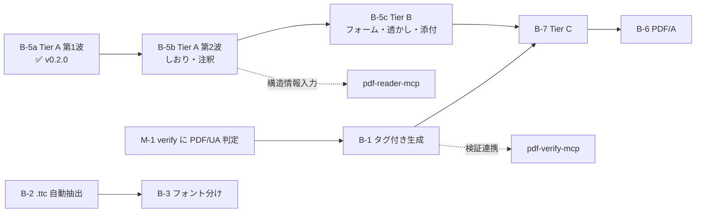

# pdf-writer-mcp 残タスクリスト

| 項目 | 内容 |
|------|------|
| 作成日 | 2026-07-16 |
| 最終更新 | 2026-07-16（v0.3.1 時点） |
| 基準 | `docs/DESIGN.md` §12（ロードマップ）／ `Document-Note/mcps/PDFfamily/specs/05-pdf-writer-mcp.md`（Tier 体系）／ `mcps/pdf-family-role-architecture.md`（責務分担提案） |
| 現状 | create 系 3（**PDF/UA 対応**）+ 編集系 11 = **14 ツール**・**138 passed**・typecheck / biome OK。v0.6.0 は 5 ツール揃ってからタグ付け予定 |

## 現状サマリ

- ✅ create 系: `create_text_pdf` / `create_markdown_pdf` / `create_table_pdf`
- ✅ 編集系 Tier A 第1波: `set_metadata` / `merge_pdfs` / `split_pdf` / `extract_pages` / `delete_pages` / `reorder_pages` / `rotate_pages`
- ✅ 日本語フォント埋め込み（**harfbuzz 事前サブセット + subset:false**。ADR-7 / ADR-8）
- ✅ グリフ欠落ポリシー（`onMissingGlyph`: error / replace / ignore）
- ✅ 署名ガード（`/ByteRange` 検知 → 既定エラー）
- ✅ vitest 8 ファイル（validation / layout / generate / extract / **render** / glyph / editor / page-spec）
- ✅ CI（typecheck + test、日本語フォント取得込み）・npm Trusted Publisher 公開

## A. 運用系

- [x] **A-1. docs のコミット & push**（2026-07-16）
- [x] **A-2. CI 整備（GitHub Actions）** — typecheck + vitest（Node 20/22）+ build。Noto Sans JP を取得し `TEST_FONT_PATH` を設定
- [x] **A-3. npm 公開** — v0.3.1 公開済み（Trusted Publisher / OIDC・provenance 付き）
- [ ] **A-4. コミット署名の運用決定** — サンドボックス経由のコミット 4 件が未署名（署名鍵は手元のみ）。方針: ①AI は stage のみ・手元で `git commit -S`（推奨）／②後で `git rebase --exec ... -S`（force push・provenance が指すコミットが消える点に注意）／③許容
- [ ] **A-5. 壊れたバージョンの deprecate** — 手元での実行待ち（下記コマンド）。0.2.0 の deprecate 文が「0.3.0 以降を」と壊れた版を案内しているため要修正
- [x] **A-6. biome 導入**（2026-07-16）— verify と同じ設定・スクリプトを追加し CI/publish に `npm run check` を組み込み。既存コードも整形済み（指摘 0）。あわせて verify の biome 版不整合（`^2.3.14` 指定 × 実体 2.5.4）を解消し、両リポジトリとも **2.5.4 に固定**（整形結果は minor 更新で変わるため、キャレット指定は手元と CI のズレを生む）

## B. 機能系

> 優先順位メモ（2026-07-16）: DESIGN.md 旧版は「タグ付き PDF が優先1位」としていたが、
> **verify 側に PDF/UA 判定が無く受け入れ基準を機械検証できない**ため、
> Tier A 編集系を先行する方針に変更済み（`mcps/pdf-family-role-architecture.md` M-1 参照）。

- [x] **B-5a. 編集系 Tier A 第1波**（v0.2.0）
- [x] **B-5b. 編集系 Tier A 第2波**（v0.4.0）: `add_bookmarks` / `add_annotation`
- [ ] **B-5c. 編集系 Tier B**（着手中）
  - [x] `attach_file`（v0.6.0・2026-07-16）— `/Names /EmbeddedFiles` + catalog `/AF` + `/AFRelationship`。
    PDF/A-3（ISO 19005-3）§6.8 準拠の形。`relationship` 省略時は Unspecified になるため警告する。
    MIME は拡張子から推定、同名は拒否（名前ツリーのキーは一意）、タグ付き PDF に添付しても veraPDF ua1 は COMPLIANT。
    pdf-lib の `attach()` が catalog /AF・/UF・/Params まで書くことを実測で確認済み（自前実装は不要だった）
  - [ ] `add_watermark` — タグ付き PDF では Artifact にすること（`markArtifactOnPage` が使える）
  - [x] `stamp_page_numbers`（2026-07-16）— `{n}`/`{total}` 書式・6 箇所の配置・`pages`/`startAt`（表紙除外）。
    **タグ付き PDF では Artifact 化**して veraPDF ua1 の COMPLIANT を維持（7.1-3）。
    ページ回転（/Rotate）を補正。**編集系で初めてフォントを扱う**ツールで、create 系と同じ font-manager を通す
    （harfbuzz サブセット・グリフ検査がそのまま効く）。
    副産物: `parsePageSpec` が開端指定（1 ページ文書への `"2-"`）を「範囲外」でなく「逆順」と誤報していたのを修正
  - [ ] `fill_form` / `flatten_form` — AcroForm。タグ付きでは Widget 注釈の扱いに注意（7.18.1-1 の例外）
- [x] **B-1. タグ付き PDF / PDF/UA-1**（v0.5.0・2026-07-16）
  - **受け入れ基準を達成**: veraPDF `--flavour ua1` で **106/106 規則・違反 0（COMPLIANT）**。text / markdown / table の 3 ツールすべて
  - `tagged: true` で opt-in（既定の出力は不変）。PDF/UA はタイトル必須のため `title` が必要
  - 構造木（StructTreeRoot / StructElem / ParentTree）・BDC/EMC・Artifact・XMP（pdfuaid + 拡張スキーマ）・/Lang・DisplayDocTitle
  - Markdown → 構造タグ（H1-H6 / L・LI・LBody / Table・TR・TH(+/Scope)・TD / BlockQuote / Code）
  - 見出しレベルの正規化（H1 始まり・飛ばさない。`# → ###` は `H1 → H2`）
  - `lang` 省略時は本文から推定し warnings で報告（かな→ja / ハングル→ko / 漢字のみ→ja だが中国語の可能性を警告）
  - **副産物のバグ修正**: 箇条書きの `•` が .notdef（豆腐）だった（v0.3.0 の回帰）。
    サブセットは入力テキスト基準だが、レンダラは入力に無い文字を足すため漏れていた。
    veraPDF の 7.21.8-1 が発見。抽出は正常だったため既存テストでは検知不能だった
  - 残課題（別タスク化）: 画像の Figure + /Alt（→ B-4）
- [x] **B-1b. タグ付き出力での注釈の Annot タグ内包**（v0.5.1・2026-07-16）
  - PDF/UA 7.18.1-1（Annot タグ内包）/ 7.18.3-1（/Tabs = /S）に対応。
    タグ付き PDF に注釈を追加しても **veraPDF ua1 で 106/106 COMPLIANT を維持**
  - `services/struct-append.ts` を新設（既存構造木への**追記**担当。struct-tree.ts はゼロから**構築**担当）。
    ParentTreeNextKey の読取・番号ツリーへの昇順挿入・/StructParent の書き戻しを実装 → **Tier C の ensure_tagged の足がかり**
  - `add_annotation` に `alt` を追加。タグ付き文書で未指定なら warnings で報告
  - タグ無し文書には構造木を作らない（注釈のためだけにタグ付けを始めない）
- [ ] **B-2. `.ttc` フェイス自動抽出** — Node 単体で完結（現状は検知してエラー）
- [ ] **B-3. 見出し / 本文のフォント分け** — 太字フェイス埋め込み。制約「インライン装飾は字面のみ」の解消
- [ ] **B-4. 画像埋め込み・ヘッダー / フッター**（ページ番号は B-5c の `stamp_page_numbers` に統合）
- [ ] **B-7. Tier C** — `edit_text` / `ensure_tagged` / `incremental_save`（署名保持）。pdf-engine-core と合流
- [ ] **B-6. PDF/A 変換** — サブセット名 `ABCDEF+` 接頭辞の正規化を含む（外部ツール連携検討）

## C. 既知の制約との対応

| 制約 | 対応タスク |
|------|-----------|
| インライン装飾が字面のみ | B-3 |
| `.ttc` 非対応 | B-2 |
| サブセット名接頭辞なし | B-6 |
| 署名済み PDF の編集で署名が無効化 | B-7（`incremental_save`）。暫定は署名ガードで防御済み |
| poppler の `Mismatch between font type` 警告 | 無害。対応不要 |

## D. family 連携（`mcps/pdf-family-role-architecture.md` 由来・writer 外だが writer に影響）

- [x] **M-1. verify に PDF/UA flavour 追加**（pdf-verify-mcp v0.6.0・2026-07-16）
  - `validate_conformance` に `flavour: "pdfua-1" / "pdfua-2"` を追加。veraPDF 委譲（`--flavour ua1`）＋ネイティブ 12 規則
  - reader の `validate_tagged` の上位互換（Figure の `/Alt` 実在・Link の `/Contents` は reader が見ていない）
  - **B-1 の受け入れ基準が機械検証可能になった**（上記 B-1 の表を参照）
  - **veraPDF 委譲が実環境で稼働確認済み**（106 規則）。native の 6 指摘は veraPDF の指摘と矛盾せず、
    ネイティブ規則の妥当性が裏付けられた。同時に native では届かない 4 項目も判明（B-1 の表の太字）
- [ ] **M-2. reader の `validate_tagged` / `validate_metadata` の deprecation 予告** — verify へ移管済みのため description で誘導 → 次メジャーで削除
- [ ] **M-6. specs/05 に Tier 0（create 系）を追記** — 実装済み MVP が上位仕様の Tier 体系に存在しない

## 依存関係

