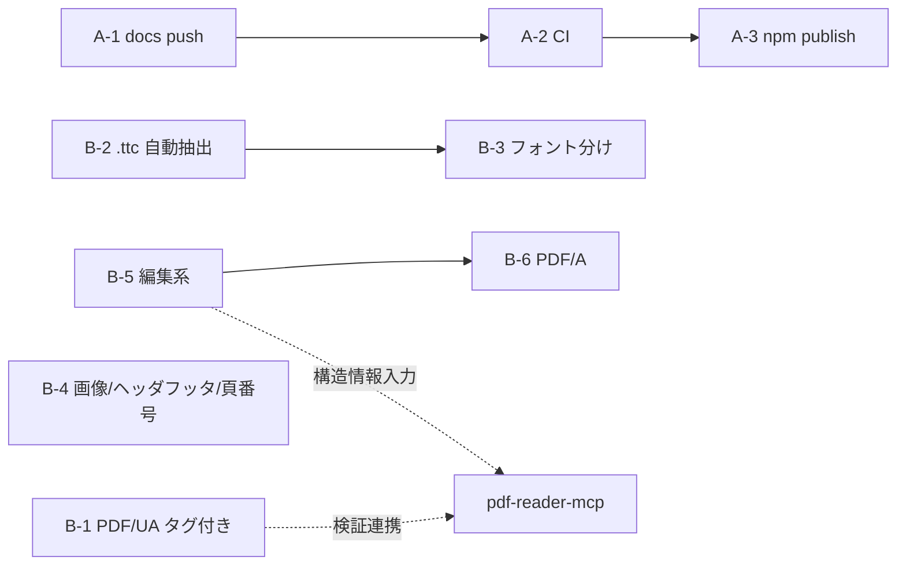

# pdf-writer-mcp 残タスクリスト

| 項目 | 内容 |
|------|------|
| 作成日 | 2026-07-16 |
| 基準 | docs/DESIGN.md §1.2（対象外）・§10（既知の制約）・§12（ロードマップ） |
| 現状 | MVP 3ツール実装済み・テスト 53 passed / 2 skipped・typecheck OK |

## 現状サマリ

- ✅ 実装済み: `create_text_pdf` / `create_markdown_pdf` / `create_table_pdf`
- ✅ 日本語フォントのサブセット埋め込み（fontkit / subset:true）
- ✅ ToUnicode CMap（pdf-lib 自動付与を回帰テストで担保）
- ✅ vitest 4ファイル（validation / layout / generate / extract）

## A. 運用系（すぐ着手可能）

- [ ] **A-1. docs/ のコミット & push** — `docs/DESIGN.md` が未追跡、main が origin より 1 commit ahead
- [ ] **A-2. CI 整備（GitHub Actions）** — `.github/workflows/` なし。typecheck + vitest（標準フォント分）を実行
- [ ] **A-3. npm 公開** — `@shuji-bonji/pdf-writer-mcp` は未公開。README も `npx` 起動例へ更新

## B. 機能系（ロードマップ順・DESIGN.md §12）

> ⚠️ 整合メモ（2026-07-16）: 上位仕様 `Document-Note/mcps/PDFfamily/specs/05-pdf-writer-mcp.md` は Tier A（メタデータ/ページ操作/しおり/注釈）→ B（フォーム/透かし/添付）→ C（本文編集/タグ木保守/増分更新）の段階制を定めており、本リストと順序が異なる。実装済 create 系は specs/05 に存在しない（Tier 0 として追記提案中）。優先順位は `mcps/pdf-family-role-architecture.md` の合意後に確定すること。

- [ ] **B-1. タグ付き PDF / PDF/UA**（DESIGN.md 上の優先1位）
  - ※ specs/05 ではタグ木の**保守**（`ensure_tagged`）は Tier C（重量級）。本タスクの「新規生成時のタグ付与」はそれより軽く、位置づけの再判断が必要
  - StructTreeRoot・マーク付きコンテンツ（BDC/EMC）の付与
  - Markdown の見出し/リスト/表 → 構造タグへのマッピング
  - pdf-reader-mcp の `inspect_tags` / `validate_tagged` で検証可能にする
- [ ] **B-2. `.ttc` フェイス自動抽出** — Node 単体で完結（現状は検知してエラー）
- [ ] **B-3. 見出し/本文のフォント分け** — 太字フェイス埋め込み。制約「インライン装飾は字面のみ」の解消と関連
- [ ] **B-4. 画像埋め込み・ヘッダー/フッター・ページ番号**
- [ ] **B-5. 編集系ツール**（reader の後段: read → edit → verify。specs/05 の Tier A/B に対応）
  - Tier A 相当: `set_metadata` / `merge_pdfs` / `split_pdf` / `rotate_pages` / `extract_pages` / `add_bookmarks` / `add_annotation`（DESIGN.md 案の `delete_pages` / `reorder_pages` 含む）
  - Tier B 相当: `fill_form` / `flatten_form` / `add_watermark` / `attach_file`（PDF/A-3・電帳法）/ `stamp_page_numbers`
  - 設計原則: 署名済 PDF は増分更新を既定とし署名を壊さない（specs/05 §3-1。本格対応は Tier C `incremental_save`）
- [ ] **B-6. PDF/A 変換** — サブセット名 `ABCDEF+` 接頭辞の正規化を含む（外部ツール連携検討）

## C. 既知の制約（§10）との対応

| 制約 | 対応タスク |
|------|-----------|
| インライン装飾が字面のみ | B-3 |
| `.ttc` 非対応 | B-2 |
| サブセット名接頭辞なし | B-6 |
| poppler 警告（無害） | 対応不要 |

## 依存関係

