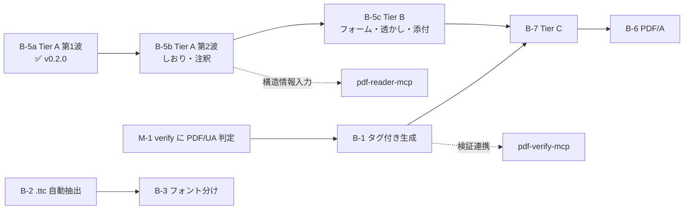

# pdf-writer-mcp 残タスクリスト

| 項目 | 内容 |
|------|------|
| 作成日 | 2026-07-16 |
| 最終更新 | 2026-07-16（v0.3.1 時点） |
| 基準 | `docs/DESIGN.md` §12（ロードマップ）／ `Document-Note/mcps/PDFfamily/specs/05-pdf-writer-mcp.md`（Tier 体系）／ `mcps/pdf-family-role-architecture.md`（責務分担提案） |
| 現状 | create 系 3 + 編集系 7 = **10 ツール**・**90 passed**・typecheck OK・npm 公開済み |

## 現状サマリ

- ✅ create 系: `create_text_pdf` / `create_markdown_pdf` / `create_table_pdf`
- ✅ 編集系 Tier A 第1波: `set_metadata` / `merge_pdfs` / `split_pdf` / `extract_pages` / `delete_pages` / `reorder_pages` / `rotate_pages`
- ✅ 日本語フォント埋め込み（**harfbuzz 事前サブセット + subset:false**。ADR-7 / ADR-8）
- ✅ グリフ欠落ポリシー（`onMissingGlyph`: error / replace / ignore）
- ✅ 署名ガード（`/ByteRange` 検知 → 既定エラー）
- ✅ vitest 8 ファイル（validation / layout / generate / extract / **render** / glyph / editor / page-spec）
- ✅ CI（typecheck + test、日本語フォント取得込み）・npm Trusted Publisher 公開

## A. 運用系

- [x] **A-1. docs のコミット & push**（2026-07-16）
- [x] **A-2. CI 整備（GitHub Actions）** — typecheck + vitest（Node 20/22）+ build。Noto Sans JP を取得し `TEST_FONT_PATH` を設定
- [x] **A-3. npm 公開** — v0.3.1 公開済み（Trusted Publisher / OIDC・provenance 付き）
- [ ] **A-4. コミット署名の運用決定** — サンドボックス経由のコミット 4 件が未署名（署名鍵は手元のみ）。方針: ①AI は stage のみ・手元で `git commit -S`（推奨）／②後で `git rebase --exec ... -S`（force push・provenance が指すコミットが消える点に注意）／③許容
- [ ] **A-5. 0.2.x 系の deprecate** — 0.2.0 は deprecate 済み。0.3.0（抽出破損）も要 deprecate
- [ ] **A-6. biome 導入の検討** — family 標準（verify 等）は `npm run check` を CI に含むが writer は未導入

## B. 機能系

> 優先順位メモ（2026-07-16）: DESIGN.md 旧版は「タグ付き PDF が優先1位」としていたが、
> **verify 側に PDF/UA 判定が無く受け入れ基準を機械検証できない**ため、
> Tier A 編集系を先行する方針に変更済み（`mcps/pdf-family-role-architecture.md` M-1 参照）。

- [x] **B-5a. 編集系 Tier A 第1波**（v0.2.0）
- [ ] **B-5b. 編集系 Tier A 第2波**: `add_bookmarks` / `add_annotation`（pdf-lib 低レベル辞書操作）**← 次の第一候補**
- [ ] **B-5c. 編集系 Tier B**: `fill_form` / `flatten_form` / `add_watermark` / `attach_file`（PDF/A-3・電帳法）/ `stamp_page_numbers`
- [ ] **B-1. タグ付き PDF / PDF/UA**（前提: verify への PDF/UA flavour 追加 = 役割分担提案 M-1）
  - StructTreeRoot・マーク付きコンテンツ（BDC/EMC）の付与
  - Markdown の見出し / リスト / 表 → 構造タグへのマッピング
  - ※ specs/05 ではタグ木の**保守**（`ensure_tagged`）は Tier C。新規生成時の付与はそれより軽い
- [ ] **B-2. `.ttc` フェイス自動抽出** — Node 単体で完結（現状は検知してエラー）
- [ ] **B-3. 見出し / 本文のフォント分け** — 太字フェイス埋め込み。制約「インライン装飾は字面のみ」の解消
- [ ] **B-4. 画像埋め込み・ヘッダー / フッター**（ページ番号は B-5c の `stamp_page_numbers` に統合）
- [ ] **B-7. Tier C** — `edit_text` / `ensure_tagged` / `incremental_save`（署名保持）。pdf-engine-core と合流
- [ ] **B-6. PDF/A 変換** — サブセット名 `ABCDEF+` 接頭辞の正規化を含む（外部ツール連携検討）

## C. 既知の制約との対応

| 制約 | 対応タスク |
|------|-----------|
| インライン装飾が字面のみ | B-3 |
| `.ttc` 非対応 | B-2 |
| サブセット名接頭辞なし | B-6 |
| 署名済み PDF の編集で署名が無効化 | B-7（`incremental_save`）。暫定は署名ガードで防御済み |
| poppler の `Mismatch between font type` 警告 | 無害。対応不要 |

## D. family 連携（`mcps/pdf-family-role-architecture.md` 由来・writer 外だが writer に影響）

- [ ] **M-1. verify に PDF/UA flavour 追加** — B-1 の受け入れ基準（テストオラクル）になる。**B-1 の前提**
- [ ] **M-6. specs/05 に Tier 0（create 系）を追記** — 実装済み MVP が上位仕様の Tier 体系に存在しない

## 依存関係

