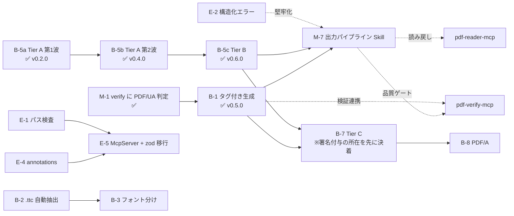

# pdf-writer-mcp 残タスクリスト

| 項目 | 内容 |
|------|------|
| 作成日 | 2026-07-16 |
| 最終更新 | 2026-07-17（v0.6.0 時点） |
| 基準 | `docs/DESIGN.md` §12（ロードマップ）／ `Document-Note/mcps/PDFfamily/specs/05-pdf-writer-mcp.md`（Tier 体系）／ `specs/06-family-implementation-standards.md`（共通実装規約）／ `specs/07-pdf-publish-skill.md`（出力パイプライン）／ `mcps/pdf-family-role-architecture.md`（責務分担提案） |
| 現状 | create 系 3（**PDF/UA 対応**）+ 編集系 15 = **18 ツール**・テスト 20 ファイル（249 ケース）・typecheck / biome OK。**v0.9.0**（2026-07-17。Tier C 着手: 署名保持の増分更新 = ADR-11） |

## 現状サマリ

- ✅ create 系（Tier 0）: `create_text_pdf` / `create_markdown_pdf` / `create_table_pdf`（`tagged: true` で PDF/UA-1）
- ✅ 編集系 Tier A: `set_metadata` / `merge_pdfs` / `split_pdf` / `extract_pages` / `delete_pages` / `reorder_pages` / `rotate_pages` / `add_bookmarks` / `add_annotation`
- ✅ 編集系 Tier B: `attach_file` / `add_watermark` / `stamp_page_numbers` / `fill_form` / `flatten_form`
- ✅ 日本語フォント埋め込み（**harfbuzz 事前サブセット + subset:false**。ADR-7 / ADR-8）
- ✅ グリフ欠落ポリシー（`onMissingGlyph`: error / replace / ignore）
- ✅ 署名ガード（`/ByteRange` 検知 → 既定エラー）
- ✅ vitest 18 ファイル（validation / layout / generate / extract / **render** / glyph / editor / page-spec / outline-annotation / tagged / struct-append / attachment / watermark / page-number / form / **registry** / errors / deterministic）
- ✅ コード衛生・family 整合 E-1〜E-6（v0.7.0）: McpServer + Zod・構造化エラー・パス検査・stdout ガード・annotations・決定論的出力
- ✅ CI（typecheck + test、日本語フォント取得込み）・npm Trusted Publisher 公開

## A. 運用系

- [x] **A-1. docs のコミット & push**（2026-07-16）
- [x] **A-2. CI 整備（GitHub Actions）** — typecheck + vitest（Node 20/22）+ build。Noto Sans JP を取得し `TEST_FONT_PATH` を設定
- [x] **A-3. npm 公開** — v0.3.1 公開済み（Trusted Publisher / OIDC・provenance 付き）
- [ ] **A-4. コミット署名の運用決定** — サンドボックス経由のコミット 4 件が未署名（署名鍵は手元のみ）。方針: ①AI は stage のみ・手元で `git commit -S`（推奨）／②後で `git rebase --exec ... -S`（force push・provenance が指すコミットが消える点に注意）／③許容
- [ ] **A-5. 壊れたバージョンの deprecate** — 手元での実行待ち（下記コマンド）。0.2.0 の deprecate 文が「0.3.0 以降を」と壊れた版を案内しているため要修正
- [x] **A-6. biome 導入**（2026-07-16）— verify と同じ設定・スクリプトを追加し CI/publish に `npm run check` を組み込み。既存コードも整形済み（指摘 0）。あわせて verify の biome 版不整合（`^2.3.14` 指定 × 実体 2.5.4）を解消し、両リポジトリとも **2.5.4 に固定**（整形結果は minor 更新で変わるため、キャレット指定は手元と CI のズレを生む）

## B. 機能系

> 優先順位メモ（2026-07-16）: DESIGN.md 旧版は「タグ付き PDF が優先1位」としていたが、
> **verify 側に PDF/UA 判定が無く受け入れ基準を機械検証できない**ため、
> Tier A 編集系を先行する方針に変更済み（`mcps/pdf-family-role-architecture.md` M-1 参照）。

- [x] **B-5a. 編集系 Tier A 第1波**（v0.2.0）
- [x] **B-5b. 編集系 Tier A 第2波**（v0.4.0）: `add_bookmarks` / `add_annotation`
- [ ] **B-5c. 編集系 Tier B**（着手中）
  - [x] `attach_file`（v0.6.0・2026-07-16）— `/Names /EmbeddedFiles` + catalog `/AF` + `/AFRelationship`。
    PDF/A-3（ISO 19005-3）§6.8 準拠の形。`relationship` 省略時は Unspecified になるため警告する。
    MIME は拡張子から推定、同名は拒否（名前ツリーのキーは一意）、タグ付き PDF に添付しても veraPDF ua1 は COMPLIANT。
    pdf-lib の `attach()` が catalog /AF・/UF・/Params まで書くことを実測で確認済み（自前実装は不要だった）
  - [x] `add_watermark`（2026-07-16）— 中央に斜めの透かし。`text`/`fontSize`/`color`/`opacity`/`angle`/`behind`/`pages`。
        タグ付き PDF では `markArtifactOnPage` で Artifact 化し、veraPDF ua1 106/106 COMPLIANT を維持することを確認済み。
        背面配置は pdf-lib が追記しかできないため、描画後に `/Contents` 配列の末尾（＝透かし）を先頭へ移して実現している
        （`watermark.ts` の `moveLastToFront`）。各ストリームが q/Q で自己完結しているため順序入替は安全。
  - [x] `stamp_page_numbers`（2026-07-16）— `{n}`/`{total}` 書式・6 箇所の配置・`pages`/`startAt`（表紙除外）。
    **タグ付き PDF では Artifact 化**して veraPDF ua1 の COMPLIANT を維持（7.1-3）。
    ページ回転（/Rotate）を補正。**編集系で初めてフォントを扱う**ツールで、create 系と同じ font-manager を通す
    （harfbuzz サブセット・グリフ検査がそのまま効く）。
    副産物: `parsePageSpec` が開端指定（1 ページ文書への `"2-"`）を「範囲外」でなく「逆順」と誤報していたのを修正
  - [x] `fill_form` / `flatten_form`（2026-07-16）— AcroForm。text / checkbox / dropdown / optionlist / radio。
        Widget は Annot ではなく **Form** タグに入る（PDF/UA-1 7.18.4）。記入は構造木に触らないため準拠は
        入力から引き継がれる（テストで固定）。flatten はタグ付きでは既定で拒否（veraPDF で 7.1-3 違反を確認済み。
        `allowBreakingTags: true` で強行可）。
        **pdf-lib のバグ回避**: `PDFForm.flatten()` は `/Annots` から「外観ストリームの参照」しか消さないため、
        `addToPage` が作った Kid ウィジェットの参照が宙吊りで残り poppler が `Invalid XRef entry` を出す。
        `pruneDanglingRefs`（form.ts）で掃除している。
- [x] **B-1. タグ付き PDF / PDF/UA-1**（v0.5.0・2026-07-16）
  - **受け入れ基準を達成**: veraPDF `--flavour ua1` で **106/106 規則・違反 0（COMPLIANT）**。text / markdown / table の 3 ツールすべて
  - `tagged: true` で opt-in（既定の出力は不変）。PDF/UA はタイトル必須のため `title` が必要
  - 構造木（StructTreeRoot / StructElem / ParentTree）・BDC/EMC・Artifact・XMP（pdfuaid + 拡張スキーマ）・/Lang・DisplayDocTitle
  - Markdown → 構造タグ（H1-H6 / L・LI・LBody / Table・TR・TH(+/Scope)・TD / BlockQuote / Code）
  - 見出しレベルの正規化（H1 始まり・飛ばさない。`# → ###` は `H1 → H2`）
  - `lang` 省略時は本文から推定し warnings で報告（かな→ja / ハングル→ko / 漢字のみ→ja だが中国語の可能性を警告）
  - **副産物のバグ修正**: 箇条書きの `•` が .notdef（豆腐）だった（v0.3.0 の回帰）。
    サブセットは入力テキスト基準だが、レンダラは入力に無い文字を足すため漏れていた。
    veraPDF の 7.21.8-1 が発見。抽出は正常だったため既存テストでは検知不能だった
  - 残課題（別タスク化）: 画像の Figure + /Alt（→ B-4）
- [x] **B-1b. タグ付き出力での注釈の Annot タグ内包**（v0.5.1・2026-07-16）
  - PDF/UA 7.18.1-1（Annot タグ内包）/ 7.18.3-1（/Tabs = /S）に対応。
    タグ付き PDF に注釈を追加しても **veraPDF ua1 で 106/106 COMPLIANT を維持**
  - `services/struct-append.ts` を新設（既存構造木への**追記**担当。struct-tree.ts はゼロから**構築**担当）。
    ParentTreeNextKey の読取・番号ツリーへの昇順挿入・/StructParent の書き戻しを実装 → **Tier C の ensure_tagged の足がかり**
  - `add_annotation` に `alt` を追加。タグ付き文書で未指定なら warnings で報告
  - タグ無し文書には構造木を作らない（注釈のためだけにタグ付けを始めない）
- [ ] **B-2. `.ttc` フェイス自動抽出** — Node 単体で完結（現状は検知してエラー）
- [ ] **B-3. 見出し / 本文のフォント分け** — 太字フェイス埋め込み。制約「インライン装飾は字面のみ」の解消
- [x] **B-6. `tag_form_fields`（タグ付きフォームの修復）**（v0.8.0・2026-07-17）
      - `7.18.4-1` Widget を **Form** 構造要素に内包（`struct-append.ts` の機構を `Annot`/`Form` に一般化）
      - `7.18.3-1` ページ辞書に `/Tabs S`
      - `7.18.1-3` フィールドに `/TU`（`labels` で人間可読名を指定。未指定はフィールド名で代用し警告）
      - 冪等（/StructParent 持ちはスキップ）。pdf-lib の /Kids 形とマージ形の両 Widget に対応。
        タグ無し文書は拒否（ゼロからのタグ付けは create 系 tagged / Tier C ensure_tagged の領分）
      - **veraPDF 実測**: 修復前は 7.18.1-3/7.18.3-1/7.18.4-1 のみ違反 → 修復後 **COMPLIANT (106/106)**
      - 副産物: `tagged: true` × 標準フォントは 7.21.4.1-1 で必ず違反になることが判明 →
        create 系に警告を追加（フォント埋め込みが PDF/UA の必要条件）

- [ ] **B-4. 画像埋め込み・ヘッダー / フッター**（ページ番号は B-5c の `stamp_page_numbers` に統合）
- [ ] **B-7. Tier C**（**着手済み** v0.9.0〜）— pdf-engine-core と合流。
      技術的ハードルの整理は [Issue #2](https://github.com/shuji-bonji/pdf-writer-mcp/issues/2)。
      決着（2026-07-17）: **署名付与は別 MCP（pdf-signature-mcp）に決定**（specs/05 §7-3）。
      エンジン言語は **TS（writer 内 PoC）で確立**（ADR-11）。
  - [x] **B-7a. 増分更新 PoC = 署名保持の注釈追加**（v0.9.0・2026-07-17）—
        `add_annotation` に `preserveSignatures`。`services/incremental.ts`（読み = pdf-lib /
        追記 = 自前。xref テーブル・ストリーム両対応）。Issue #2 のマイルストーンを実測達成:
        実署名（CMS）PDF への追加後、verify_signatures = **VALID**・verify_integrity =
        **合法な増分更新 1 件**・qpdf --check クリーン。
        副産物: pdf-lib が容器ストリームを登録しない採番落とし穴を発見（CLAUDE.md 落とし穴 7）
  - [ ] **B-7b. 増分更新の展開** — タグ付き文書対応（構造木の差分追記 = dirty 追跡の一般化）、
        set_metadata / add_bookmarks 等の他ツールへの `preserveSignatures` 展開
  - [ ] **B-7c. `ensure_tagged`**（タグ木の生成・修復）— struct-append / tag_form_fields の一般化
  - [ ] **B-7d. `edit_text`**（本文編集・リフロー）— コンテンツストリーム再生成。最重量級
- [ ] **B-8. PDF/A 変換** — サブセット名 `ABCDEF+` 接頭辞の正規化を含む（外部ツール連携検討）
      ※旧番号 B-6（B-6 が `tag_form_fields` と重複していたため 2026-07-17 に改番）

## C. 既知の制約との対応

| 制約 | 対応タスク |
|------|-----------|
| インライン装飾が字面のみ | B-3 |
| `.ttc` 非対応 | B-2 |
| サブセット名接頭辞なし | B-8 |
| 署名済み PDF の編集で署名が無効化 | B-7（`incremental_save`）。暫定は署名ガードで防御済み |
| poppler の `Mismatch between font type` 警告 | 無害。対応不要 |

## D. family 連携（`mcps/pdf-family-role-architecture.md` 由来・writer 外だが writer に影響）

- [x] **M-1. verify に PDF/UA flavour 追加**（pdf-verify-mcp v0.6.0・2026-07-16）
  - `validate_conformance` に `flavour: "pdfua-1" / "pdfua-2"` を追加。veraPDF 委譲（`--flavour ua1`）＋ネイティブ 12 規則
  - reader の `validate_tagged` の上位互換（Figure の `/Alt` 実在・Link の `/Contents` は reader が見ていない）
  - **B-1 の受け入れ基準が機械検証可能になった**（上記 B-1 の表を参照）
  - **veraPDF 委譲が実環境で稼働確認済み**（106 規則）。native の 6 指摘は veraPDF の指摘と矛盾せず、
    ネイティブ規則の妥当性が裏付けられた。同時に native では届かない 4 項目も判明（B-1 の表の太字）
- [ ] **M-2. reader の `validate_tagged` / `validate_metadata` の deprecation 予告** — verify へ移管済みのため description で誘導 → 次メジャーで削除
- [x] **M-6. specs/05 に Tier 0（create 系）を追記**（2026-07-17）— 実装済み MVP を上位仕様の Tier 体系に位置づけた。DESIGN.md §1.2 / §12 も Tier 対応表に改訂済み
- [x] **M-7. 出力パイプライン Skill（pdf-publish）の実装**（2026-07-17）—
      `skills/pdf-publish-skill`（SKILL.md + references 3 本 + plugin.json）として実装。
      品質ゲート水準 3 段階（none / readback / conformance）、writer 構造化エラーのコード分岐、
      違反 clause → writer 操作の修正対応表、Publish Report + opt-in JSONL 実行ログ。
      実 MCP でドライラン済み（veraPDF 106/106 COMPLIANT）。仕様: specs/07 v0.2。
      副産物: reader `inspect_fonts` の Type0 埋め込み誤報告を発見（reader 側 docs に記録）

## E. コード衛生・family 整合（2026-07-17 追加。詳細は PDFfamily `specs/06-family-implementation-standards.md`）

> family 横断レビュー（2026-07-17）で判明した、reader / verify との実装パターンのズレと
> writer 固有のリスク。出力パイプライン Skill（specs/07）が要求する契約でもあるため、
> Tier C など機能系の大物より**先に**片付ける。優先度順。
>
> **2026-07-17: E-1〜E-6 すべて v0.7.0 で対応済み**（コードレビュー対応。CHANGELOG 参照）。

- [x] **E-1. パス検査の強化** — writer は family で唯一「任意パスへ書き込む」サーバなのに、
      検査が reader / verify より緩い。
      - `inputPath` / `outputPath` / `fontPath` / `attachmentPath` に**絶対パスを強制**
        （相対パスは MCP クライアントの cwd に依存して挙動不定。reader の `validatePdfPath` と同基準）
      - `..` を含むパスの拒否（トラバーサル防御）
      - **入力 PDF のサイズ上限**を新設（verify の `MAX_FILE_SIZE` = 50MB 相当。
        `ATTACHMENT_MAX_BYTES` はあるのに入力 PDF 側が無い。merge は 50 ファイル × 無制限で膨張しうる）
- [x] **E-2. 構造化エラーへの移行** — 現状は `{error: message}` の文字列のみ。
      reader v0.6.0 と同じ `familyCode` / `next_actions` / `retryable` / `hint` 形式に揃える。
      出力パイプライン Skill が「署名ガード → `allowBreakingSignatures` を提案」等の分岐に使う。
      例: `SIGNED_PDF`（retryable: フラグ付きで再試行可）/ `FONT_REQUIRED` / `MISSING_GLYPH` /
      `ENCRYPTED_PDF` / `DOC_NOT_FOUND`
- [x] **E-3. stdout ガードの導入** — reader / verify は import 前に `console.log/warn` を
      stderr へ差し替えるガードを持つ。writer は pdfjs 非依存でリスクは低いが、
      `marked` / `subset-font`(wasm) を抱えるため family の掟として 1 ファイル追加する
- [x] **E-4. tool annotations の付与** — `readOnlyHint` / `destructiveHint` が皆無。
      family で唯一破壊的操作を持つサーバとして、`delete_pages` / `flatten_form` / `reorder_pages` 等に
      `destructiveHint: true`、全ツールに適切なヒントを付与する（E-5 と同時実施が自然）
- [x] **E-5. McpServer + zod への移行** — 現在は低レベル `Server` + 手書き asserts で、
      `definitions.ts`（553 行の JSON Schema）と `validation.ts`（502 行）が**同じ制約を二重管理**
      （fontSize の範囲検査だけで 3 箇所に重複）。zod スキーマに一元化し、
      reader / verify と同じ `registerTool` パターンに揃える。**外部仕様は不変**（ツール名・入出力とも）
- [x] **E-6. 決定論的出力オプション** — `finalizePdf` が CreationDate / ModificationDate に
      `new Date()` を焼き込むため同一入力でもバイト列が毎回変わる。学習データ工場（read-write-verify
      ループ）での差分検証・キャッシュ・再現テストのため、日時を固定できるオプション
      （例: `SOURCE_DATE_EPOCH` 環境変数 or `deterministic: true`）を追加する

## 依存関係

